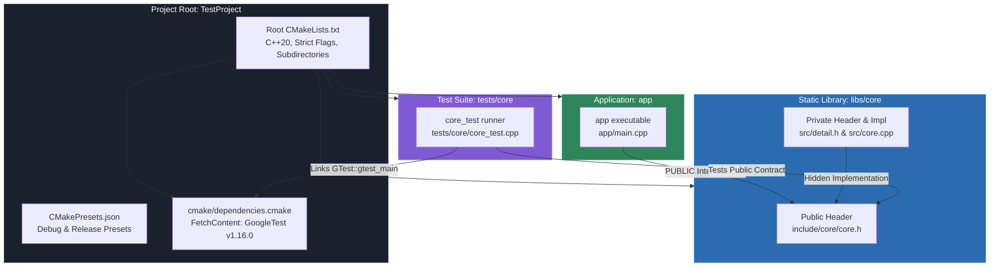

# Video & Blog Script: Phase 0 — Modern C++20 Project Baseline & Layout

> **Target Audience**: Junior Developers & Engineers learning modern C++ and CMake for the first time  
> **Format**: Video Tutorial / Technical Blog Post Blueprint  
> **Topic**: Structuring a Production-Grade C++20 Project from Scratch (Phase 0: Baseline & Layout)

---

## 1. Executive Summary & Hook

### The "C++ Beginner's Trap": Single Files & Command-Line Soup
When first learning C++, most tutorials have you write a single `main.cpp` file and compile it manually with:
```bash
g++ -std=c++20 main.cpp -o app
```
While this works for toy examples, the moment you begin building real-world software, this approach rapidly breaks down:
- **Spaghetti Headers & Multiple Definitions**: Splitting code across multiple files without clear rules leads to dreaded linker errors like `multiple definition of '...'` or circular includes.
- **Accidental Leakage**: Internal helper functions and implementation details accidentally get exposed to every part of your program.
- **"It Works on My Machine" Syndrome**: One teammate has a library installed in `/usr/local/include`, another has a different version in Homebrew, and CI fails completely.
- **Untested Logic**: Without a standardized testing framework wired into the build system, testing is done manually via `std::cout` statements.

### The Solution: A Production-Grade C++20 Baseline
In this baseline tutorial (Phase 0), we build a robust, modular, and professional C++20 scaffolding from the ground up:
1. **Target-Based CMake**: Using modern CMake 3.20+ with explicit target boundaries and visibility rules (`PUBLIC` vs `PRIVATE`).
2. **Clean Header Separation**: Strict division between public interfaces (`include/`) and private implementation details (`src/`).
3. **Reproducible Presets**: Using `CMakePresets.json` to eliminate lengthy command-line invocations and ensure identical builds across team members.
4. **Hermetic Dependencies via `FetchContent`**: Pinning third-party libraries (like GoogleTest) by exact Git tag so cloning the repo "just works" on macOS, Linux, and Windows.
5. **Zero-Warning Discipline**: Enforcing strict compiler warning flags (`-Wall -Wextra -Wpedantic -Werror`) without breaking external dependencies.

---

## 2. Architecture & Directory Blueprint

Here is the mental model of how a professional multi-target C++ project is organized:



### The Directory Tree Explained
```
.
├── CMakeLists.txt          # Root build definition (project metadata, standards, compiler flags)
├── CMakePresets.json       # Standardized configure, build, and test presets (Ninja, Debug, Release)
├── README.md               # Quick-start guide for onboarding developers
├── cmake/
│   └── dependencies.cmake  # Centralized third-party dependency fetching (GoogleTest)
├── libs/
│   └── core/               # Reusable business logic library
│       ├── CMakeLists.txt  # Target definition for 'core' library
│       ├── include/        # PUBLIC headers exposed to library consumers
│       │   └── core/
│       │       └── core.h
│       └── src/            # PRIVATE implementation and internal headers
│           ├── core.cpp
│           └── detail.h
├── app/                    # Executable entry point
│   ├── CMakeLists.txt      # Target definition for 'app'
│   └── main.cpp            # Thin main() calling into core library
└── tests/                  # Automated unit test suite (mirrors libs/ structure)
    ├── CMakeLists.txt      # Test discovery harness
    └── core/
        ├── CMakeLists.txt  # Target definition for 'core_test'
        └── core_test.cpp   # GoogleTest test cases
```

---

## 3. Step-by-Step Implementation Guide

---

### Step 1: Root Configuration & Compiler Discipline
**File**: `CMakeLists.txt`

The root `CMakeLists.txt` is the orchestrator. It establishes the required CMake version, names the project, locks the C++ language standard to C++20, enables testing, and pulls in submodules.

```cmake
cmake_minimum_required(VERSION 3.20)

project(TestProject
  VERSION 0.1.0
  DESCRIPTION "Minimal C++20 project scaffold"
  LANGUAGES CXX
)

# Enforce strict modern C++20
set(CMAKE_CXX_STANDARD 20)
set(CMAKE_CXX_STANDARD_REQUIRED ON)
set(CMAKE_CXX_EXTENSIONS OFF)

# Fetch external dependencies before applying strict warning flags so that
# third-party code (GoogleTest) is not built with -Werror.
include(cmake/dependencies.cmake)

# Enable aggressive compiler warnings and treat all warnings as errors
if(CMAKE_CXX_COMPILER_ID MATCHES "Clang|GNU")
  add_compile_options(-Wall -Wextra -Wpedantic -Werror)
endif()

enable_testing()

# Traverse into project subdirectories
add_subdirectory(libs/core)
add_subdirectory(app)
add_subdirectory(tests)
```

> **Beginner Deep-Dive & Voiceover**:
> 1. `CMAKE_CXX_EXTENSIONS OFF`: By default, compilers enable compiler-specific extensions (like GNU extensions). Turning this `OFF` ensures your code stays strictly standard C++ and remains portable.
> 2. **Warning Order Matters**: Notice that we `include(cmake/dependencies.cmake)` **before** adding `-Werror`. If we applied `-Werror` globally before downloading third-party code, a single harmless warning inside an external library would halt our entire build!

---

### Step 2: One-Click Builds with CMake Presets
**File**: `CMakePresets.json`

Remembering flags like `cmake -B build/debug -S . -G Ninja -DCMAKE_BUILD_TYPE=Debug` is tedious and error-prone. CMake Presets codify these settings into a single JSON specification.

```json
{
  "version": 6,
  "cmakeMinimumRequired": {
    "major": 3,
    "minor": 20,
    "patch": 0
  },
  "configurePresets": [
    {
      "name": "debug",
      "displayName": "Debug",
      "generator": "Ninja",
      "binaryDir": "${sourceDir}/build/debug",
      "cacheVariables": {
        "CMAKE_BUILD_TYPE": "Debug"
      }
    },
    {
      "name": "release",
      "displayName": "Release",
      "generator": "Ninja",
      "binaryDir": "${sourceDir}/build/release",
      "cacheVariables": {
        "CMAKE_BUILD_TYPE": "Release"
      }
    }
  ],
  "buildPresets": [
    {
      "name": "debug",
      "displayName": "Debug",
      "configurePreset": "debug"
    },
    {
      "name": "release",
      "displayName": "Release",
      "configurePreset": "release"
    }
  ],
  "testPresets": [
    {
      "name": "debug",
      "displayName": "Debug",
      "configurePreset": "debug",
      "output": {
        "outputOnFailure": true
      }
    },
    {
      "name": "release",
      "displayName": "Release",
      "configurePreset": "release",
      "output": {
        "outputOnFailure": true
      }
    }
  ]
}
```

> **Beginner Deep-Dive & Voiceover**:
> - **Out-of-Source Builds**: Notice `binaryDir: "${sourceDir}/build/debug"`. In C++, we **never** compile source files directly in the source folders. Build artifacts (object files, binaries) live cleanly in `build/`, keeping Git history clean and making full rebuilds as simple as deleting the `build/` folder.
> - **Ninja**: Ninja is an ultra-fast, lightweight build tool designed specifically to run compilation steps in parallel.

---

### Step 3: Centralized Dependencies via `FetchContent`
**File**: `cmake/dependencies.cmake`

Modern CMake eliminates manual library installation by downloading and compiling dependencies directly during the configuration phase.

```cmake
include(FetchContent)

# GoogleTest — pinned to exact release v1.16.0
FetchContent_Declare(
  googletest
  GIT_REPOSITORY https://github.com/google/googletest.git
  GIT_TAG v1.16.0
  GIT_SHALLOW TRUE
)

# Prevent GoogleTest from installing itself into the system targets
set(INSTALL_GTEST OFF CACHE BOOL "" FORCE)

# Download and register targets (GTest::gtest, GTest::gtest_main)
FetchContent_MakeAvailable(googletest)
```

> **Beginner Deep-Dive & Voiceover**:
> *"Why `GIT_TAG v1.16.0` instead of `main`? Pinning exact version tags makes builds deterministic. A year from now, running this build on a new machine will produce the exact same binary without surprises from upstream breaking changes."*

---

### Step 4: Library Design — Interface vs Implementation
We structure our library under `libs/core/` using a clean physical separation:
- `include/core/`: Public headers (the API exposed to consumers).
- `src/`: Private headers and translation units (implementation details hidden from consumers).

#### 4A. Target Definition (`libs/core/CMakeLists.txt`)
```cmake
add_library(core STATIC
  src/core.cpp
)

# Public interface: only include/ is exposed to consumers.
# Private headers (src/detail.h) are included by filename from within src/.
target_include_directories(core
  PUBLIC
    ${CMAKE_CURRENT_SOURCE_DIR}/include
)
```

> **Key Rule: Modern Target-Based CMake**:
> Notice we use `target_include_directories(core PUBLIC ...)` instead of the old, global `include_directories(...)`.
> - **`PUBLIC`**: Anything inside `${CMAKE_CURRENT_SOURCE_DIR}/include` is used when compiling `core` **and** is automatically forwarded to any target that links `core` (e.g., `app` and `tests`).
> - The private directory `src/` is **never** added to public include paths.

#### 4B. Public Header (`libs/core/include/core/core.h`)
```cpp
#pragma once

#include <string>

namespace core {

// Placeholder public API — replace with the real functionality as the
// project takes shape.
std::string version();

}  // namespace core
```

#### 4C. Private Implementation Detail (`libs/core/src/detail.h`)
```cpp
#pragma once

// Private implementation details for core.
// Not part of the public API: included only by translation units in src/.

namespace core::detail {

inline constexpr char kVersion[] = "0.1.0";

}  // namespace core::detail
```

#### 4D. Translation Unit (`libs/core/src/core.cpp`)
```cpp
#include "core/core.h"

#include "detail.h"

namespace core {

std::string version() { return detail::kVersion; }

}  // namespace core
```

> **C++ Fundamentals Checklist**:
> 1. `#pragma once`: A preprocessor directive ensuring this header file is included only once per translation unit, preventing duplicate symbol definition errors.
> 2. `namespace core`: Namespaces prevent naming collisions. If another library has a `version()` function, `core::version()` remains distinct and unambiguous.
> 3. `inline constexpr`: In C++20, `constexpr` denotes values known at compile-time. `inline` avoids duplicate variable definition issues when constants are declared in headers.

---

### Step 5: The Application Entry Point
**File**: `app/CMakeLists.txt` and `app/main.cpp`

The application (`app`) is a thin executable layer whose sole purpose is bootstrapping the process and delegating work to our modular libraries.

#### Target Definition (`app/CMakeLists.txt`)
```cmake
add_executable(app main.cpp)

# Link the core static library privately to this executable
target_link_libraries(app PRIVATE core)
```

#### Executable Code (`app/main.cpp`)
```cpp
#include <iostream>

#include "core/core.h"

int main() {
  std::cout << "TestProject " << core::version() << '\n';
  return 0;
}
```

> **Notice**: `main.cpp` includes `"core/core.h"` (thanks to the `PUBLIC` include path propagated from the `core` CMake target). It has no access to `detail.h`, enforcing strong encapsulation.

---

### Step 6: Automated Unit Testing with GoogleTest & CTest
A project without tests is legacy code from day one. We wire GoogleTest directly into CMake's test runner, **CTest**.

#### 6A. Test Discovery Root (`tests/CMakeLists.txt`)
```cmake
# Make gtest_discover_tests() available to test subdirectories.
include(GoogleTest)

add_subdirectory(core)
```

#### 6B. Test Target Definition (`tests/core/CMakeLists.txt`)
```cmake
add_executable(core_test core_test.cpp)

target_link_libraries(core_test
  PRIVATE
    core
    GTest::gtest_main
)

# Register each gtest case as an individual CTest test.
gtest_discover_tests(core_test)
```

> **Beginner Tip**: Linking `GTest::gtest_main` provides an automated, standard `main()` function for your test binary so you don't have to write one manually!

#### 6C. Unit Test Implementation (`tests/core/core_test.cpp`)
```cpp
#include <gtest/gtest.h>

#include "core/core.h"

TEST(CoreTest, VersionIsNotEmpty) {
  EXPECT_FALSE(core::version().empty());
}
```

---

## 4. Fundamental C++ & CMake Concepts for Beginners

| Concept | What It Is | Why We Use It |
|---|---|---|
| **Declaration vs. Definition** | Declaration (`std::string version();`) states a function exists. Definition (`std::string version() { ... }`) provides the body. | Keeps header files lightweight and separates public contracts from implementation details. |
| **Translation Unit (TU)** | A single `.cpp` file after the preprocessor has expanded all `#include` directives. | Compilers compile each TU independently into an object file (`.o` / `.obj`), then the linker binds them. |
| **`PUBLIC` vs `PRIVATE` in CMake** | `PUBLIC` requirements propagate to consumers. `PRIVATE` requirements stay internal to the target. | Prevents internal implementation details and private include paths from polluting consumers. |
| **Out-of-Source Build** | Compiling all temporary files into a separate folder (e.g., `build/debug`) rather than next to source files. | Keeps project directories pristine and makes cleaning artifacts as simple as `rm -rf build`. |
| **CTest Integration** | CMake's integrated test runner (`ctest`). | Provides unified test execution, test filtering, parallel test runs, and clear CI pass/fail reporting. |

---

## 5. Common Beginner Pitfalls & Anti-Patterns

| Anti-Pattern | Why It Causes Problems | Best Practice |
|---|---|---|
| `#include "core.cpp"` in another file | Compiling the same C++ implementation twice creates duplicate symbol errors at link time. | Never `#include` `.cpp` files. Include only header files (`.h`). |
| `using namespace std;` in header files | Injects thousands of standard library names into every file that includes that header, causing silent name collisions. | Use explicit prefixes in headers (e.g., `std::string`, `std::vector`). |
| Global `include_directories(...)` | Exposes every directory to every target in the project, destroying encapsulation. | Use target-scoped `target_include_directories(my_target PUBLIC/PRIVATE ...)`. |
| Missing `#pragma once` | If two headers include the same third header, the compiler encounters duplicate declarations and fails. | Always start every `.h` header with `#pragma once`. |
| Hardcoding absolute paths in CMake | Breaks compilation on any other machine or CI container. | Always use CMake generator variables like `${CMAKE_CURRENT_SOURCE_DIR}`. |

---

## 6. Live Terminal Demo & Verification Cues

Let's verify the entire baseline workflow step by step using CMake Presets in the terminal:

### 1. Configure the Project
```bash
cmake --preset debug
```
*Expected Output*:
```text
Preset CMake variables:

  CMAKE_BUILD_TYPE="Debug"

-- The CXX compiler identification is ...
-- Detecting CXX compiler ABI info
-- Detecting CXX compiler ABI info - done
-- Check for working CXX compiler: ... - works
-- Populating googletest
-- Configuring done (1.2s)
-- Generating done (0.0s)
-- Build files have been written to: .../build/debug
```

### 2. Compile All Targets
```bash
cmake --build --preset debug
```
*Expected Output*:
```text
[1/6] Building CXX object libs/core/CMakeFiles/core.dir/src/core.cpp.o
[2/6] Linking CXX static library libs/core/libcore.a
[3/6] Building CXX object app/CMakeFiles/app.dir/main.cpp.o
[4/6] Linking CXX executable app/app
[5/6] Building CXX object tests/core/CMakeFiles/core_test.dir/core_test.cpp.o
[6/6] Linking CXX executable tests/core/core_test
```

### 3. Run Automated Tests with CTest
```bash
ctest --preset debug
```
*Expected Output*:
```text
Test project .../build/debug
    Start 1: CoreTest.VersionIsNotEmpty
1/1 Test #1: CoreTest.VersionIsNotEmpty ........   Passed    0.01 sec

100% tests passed, 0 tests failed out of 1
```

### 4. Execute the Main Application
```bash
./build/debug/app/app
```
*Expected Output*:
```text
TestProject 0.1.0
```

---

## 7. Next Steps: On to Phase 1!

Congratulations! You now have a rock-solid, production-ready modern C++20 baseline featuring modular static libraries, public/private header encapsulation, reproducible presets, and automated GoogleTest testing.

In **Phase 1: CMake & SQLiteCpp Setup**, we will take this baseline and add a persistent database infrastructure layer, introducing:
- Fetching and compiling `SQLiteCpp` and embedded `SQLite3` from source with `FetchContent`.
- Applying the **Pointer-to-Implementation (Pimpl)** idiom to encapsulate third-party driver headers.
- Writing automated in-memory SQLite smoke tests with GoogleTest.
