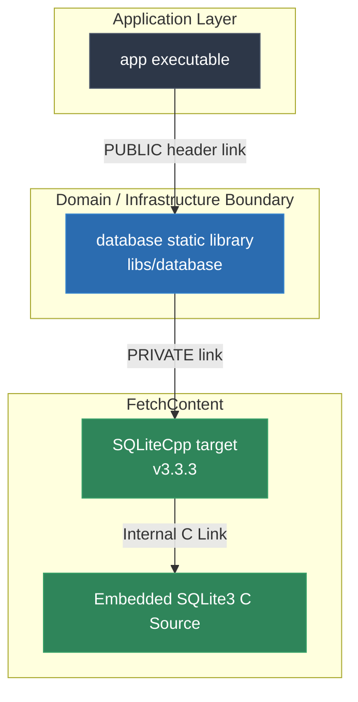

# Video & Blog Script: Phase 1 — CMake & SQLiteCpp Setup

> **Target Audience**: C++ Developers, Systems Engineers, and Software Architects  
> **Format**: Video Tutorial / Technical Blog Post Blueprint  
> **Topic**: Building a Deterministic C++20 Database Layer from Scratch (Phase 1)

---

## 1. Executive Summary & Hook

### The "Works on My Machine" Problem in C++
In C++ database development, a common failure mode is relying on pre-installed system packages or ambient global paths (`find_package(SQLite3)` or manual `include_directories`). This leads to subtle, frustrating bugs:
- **Environment Drift**: Developer A compiles against SQLite 3.32 on macOS Homebrew; CI runs SQLite 3.31 on Ubuntu; Production runs SQLite 3.34.
- **Header Pollution**: Public headers `#include <SQLiteCpp/Database.h>`, forcing every application module to depend directly on driver headers.
- **Fragile Onboarding**: A new team member clones the repo and gets CMake configuration errors because `libsqlite3-dev` is missing.

### The Solution: Deterministic Architecture
Phase 1 solves this by creating a self-contained, reproducible CMake dependency graph:
1. **Pinned Source Dependencies**: Third-party dependencies (`SQLiteCpp 3.3.3` + internal `SQLite3`) are fetched and built from source at configure time using CMake `FetchContent`.
2. **Encapsulated Target Boundary**: A dedicated static library (`database`) encapsulates driver details via `PRIVATE` linkage and the Pointer-to-Implementation (Pimpl) idiom.
3. **Automated Verification**: GoogleTest + CTest smoke tests validate in-memory (`:memory:`) database operations cleanly.

---

## 2. Architecture & Dependency Flow



### Key Target Visibility Rule
- `app` **only** includes `database/database.h`. It has **zero** compile-time knowledge of `<SQLiteCpp/Database.h>` or `<sqlite3.h>`.
- `database` links `SQLiteCpp` as `PRIVATE`. This strictly prevents driver header leakage.

---

## 3. Step-by-Step Implementation Guide

### Step 1: Centralized Dependency Ingestion
**File**: `cmake/dependencies.cmake`

```cmake
include(FetchContent)

# GoogleTest — pinned release
FetchContent_Declare(
  googletest
  GIT_REPOSITORY https://github.com/google/googletest.git
  GIT_TAG v1.16.0
  GIT_SHALLOW TRUE
)
set(INSTALL_GTEST OFF CACHE BOOL "" FORCE)
FetchContent_MakeAvailable(googletest)

# SQLiteCpp — pinned tag 3.3.3 with internal SQLite3 source
FetchContent_Declare(
  SQLiteCpp
  GIT_REPOSITORY https://github.com/SRombauts/SQLiteCpp.git
  GIT_TAG 3.3.3
  GIT_SHALLOW TRUE
)

# Force internal SQLite3 compilation to eliminate host OS variance
set(SQLITECPP_INTERNAL_SQLITE ON CACHE BOOL "" FORCE)
set(SQLITECPP_BUILD_TESTS OFF CACHE BOOL "" FORCE)
set(SQLITECPP_RUN_CPPLINT OFF CACHE BOOL "" FORCE)
set(SQLITECPP_INSTALL OFF CACHE BOOL "" FORCE)

FetchContent_MakeAvailable(SQLiteCpp)
```

> **Voiceover / Blog Callout**:
> *"Notice `SQLITECPP_INTERNAL_SQLITE ON`. By embedding SQLite's C source code directly, we eliminate host linker surprises. Also, we set options BEFORE calling `FetchContent_MakeAvailable` so CMake configures the target correctly."*

---

### Step 2: Database Library Target Definition
**File**: `libs/database/CMakeLists.txt`

```cmake
add_library(database STATIC
  src/database.cpp
)

target_include_directories(database
  PUBLIC
    ${CMAKE_CURRENT_SOURCE_DIR}/include
)

# Encapsulate SQLiteCpp as a PRIVATE implementation detail
target_link_libraries(database
  PRIVATE
    SQLiteCpp
)
```

---

### Step 3: Public API & Pimpl Encapsulation

**Public Header (`libs/database/include/database/database.h`)**:
```cpp
#pragma once

#include <memory>
#include <string>

namespace database {

class Connection {
 public:
  explicit Connection(const std::string& db_name = ":memory:");
  ~Connection();

  Connection(const Connection&) = delete;
  Connection& operator=(const Connection&) = delete;

  Connection(Connection&&) noexcept;
  Connection& operator=(Connection&&) noexcept;

  void execute(const std::string& sql);
  int execute_scalar_int(const std::string& sql);
  bool is_open() const noexcept;

 private:
  struct Impl;
  std::unique_ptr<Impl> impl_;
};

std::string version();

}  // namespace database
```

**Implementation Source (`libs/database/src/database.cpp`)**:
```cpp
#include "database/database.h"
#include <SQLiteCpp/Database.h>
#include "detail.h"

namespace database {

struct Connection::Impl {
  SQLite::Database db;

  explicit Impl(const std::string& db_name)
      : db(db_name, SQLite::OPEN_READWRITE | SQLite::OPEN_CREATE) {}
};

Connection::Connection(const std::string& db_name)
    : impl_(std::make_unique<Impl>(db_name)) {}

Connection::~Connection() = default;

Connection::Connection(Connection&&) noexcept = default;
Connection& Connection::operator=(Connection&&) noexcept = default;

void Connection::execute(const std::string& sql) {
  impl_->db.exec(sql);
}

int Connection::execute_scalar_int(const std::string& sql) {
  return impl_->db.execAndGet(sql).getInt();
}

bool Connection::is_open() const noexcept {
  return impl_ != nullptr;
}

std::string version() {
  return detail::kVersion;
}

}  // namespace database
```

> **Voiceover / Blog Callout**:
> *"By using the Pointer-to-Implementation (Pimpl) pattern, `database.h` remains completely clean. Any changes to `SQLiteCpp` or internal connection structures will only recompile `database.cpp`, saving significant build time in large projects."*

---

### Step 4: Unit Testing with GoogleTest & CTest
**File**: `tests/database/database_test.cpp`

```cpp
#include <gtest/gtest.h>
#include "database/database.h"

TEST(DatabaseTest, VersionIsNotEmpty) {
  EXPECT_FALSE(database::version().empty());
}

TEST(DatabaseTest, InMemoryDatabaseSmokeTest) {
  database::Connection conn(":memory:");
  EXPECT_TRUE(conn.is_open());

  conn.execute("CREATE TABLE users (id INTEGER PRIMARY KEY, name TEXT NOT NULL)");
  conn.execute("INSERT INTO users (name) VALUES ('Alice')");
  conn.execute("INSERT INTO users (name) VALUES ('Bob')");

  const int count = conn.execute_scalar_int("SELECT COUNT(*) FROM users");
  EXPECT_EQ(count, 2);
}
```

---

### Step 5: Application Scaffolding
**File**: `app/main.cpp`

```cpp
#include <iostream>
#include "core/core.h"
#include "database/database.h"

int main() {
  std::cout << "TestProject " << core::version() << '\n';
  std::cout << "Database module version " << database::version() << '\n';

  try {
    database::Connection conn(":memory:");
    conn.execute("CREATE TABLE app_info (id INTEGER PRIMARY KEY, key TEXT NOT NULL, value TEXT NOT NULL)");
    conn.execute("INSERT INTO app_info (key, value) VALUES ('status', 'active')");

    const int count = conn.execute_scalar_int("SELECT COUNT(*) FROM app_info");
    std::cout << "Database initialized successfully. Row count: " << count << '\n';
  } catch (const std::exception& e) {
    std::cerr << "Database error: " << e.what() << '\n';
    return 1;
  }

  return 0;
}
```

---

## 4. Common Pitfalls & Anti-Patterns

| Anti-Pattern | Why it Fails | Phase 1 Best Practice |
|---|---|---|
| `find_package(SQLite3)` | Fails on environments lacking SQLite dev headers; causes version mismatch. | Use `FetchContent` with `SQLITECPP_INTERNAL_SQLITE ON`. |
| Including `<SQLiteCpp/Database.h>` in public header | Pollutes application code with third-party headers and slows down compilation. | Use Pimpl idiom and link `SQLiteCpp` as `PRIVATE`. |
| Adding `-Werror` before `FetchContent` | Causes third-party dependencies with mild warnings to fail the build. | Include `cmake/dependencies.cmake` *before* setting strict compiler options. |
| Using deprecated `FetchContent_Populate` | Deprecated in modern CMake (3.14+ / 3.28+). | Use `FetchContent_MakeAvailable()`. |

---

## 5. Live Terminal Demo & Verification Cues

### Commands to Run On Screen / In Article
1. **Configure & Build**:
   ```bash
   cmake -B build -S . -DCMAKE_BUILD_TYPE=Debug
   cmake --build build
   ```
2. **Execute Unit Tests**:
   ```bash
   ctest --test-dir build --output-on-failure
   ```
   *Expected Output*: `100% tests passed out of 3`
3. **Run Main Application**:
   ```bash
   ./build/debug/app/app
   ```
   *Expected Output*:
   ```text
   TestProject 0.1.0
   Database module version 0.1.0
   Database initialized successfully. Row count: 1
   ```

---

## 6. Teaser for Phase 2

Now that our dependency graph is deterministic and our database target is fully encapsulated, we are ready for **Phase 2: Database Lifecycle Service & RAII Transactions**.

In Phase 2, we will cover:
- Exception-safe transaction guards (`Transaction` class).
- RAII-managed connection lifecycles and WAL mode configuration.
- Robust exception handling and mapping SQLite error codes to domain exceptions.

