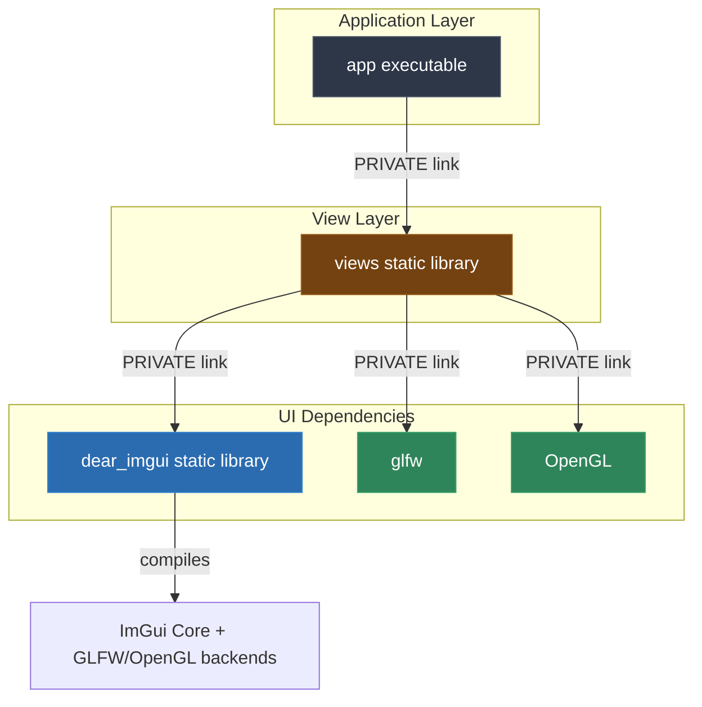

# Video & Blog Script: Phase 10 — Dear ImGui Integration

> **Target Audience**: C++ Developers, Systems Engineers, and Software Architects  
> **Format**: Video Tutorial / Technical Blog Post Blueprint  
> **Topic**: Adding Dear ImGui to a Modern C++20 Application with a Dedicated Views Layer and GLFW/OpenGL Backend (Phase 10)

---

## 1. Executive Summary & Hook

### The "We Need a Real Tool Window, Not More Console Output" Problem
At some point, printing diagnostics to `std::cout` stops being enough. We need a real GUI surface for internal tools, debug panels, and live state inspection.

But there are two common ways to get this wrong:
- **UI Logic Leaks into `main.cpp`**: The application layer starts building widgets directly, and composition code turns into presentation code.
- **The Build Stops Being Reproducible**: A GUI dependency works on one developer machine only because system libraries happened to be present.

### The Solution: Isolate Dear ImGui in `libs/views`
Phase 10 adds Dear ImGui with a concrete **GLFW + OpenGL3** backend, but keeps the architecture disciplined:
1. **Pinned Source Dependencies**: Dear ImGui and GLFW are fetched by CMake at known revisions.
2. **Dedicated View Layer**: All ImGui and backend code lives in `libs/views`, not the application layer.
3. **Thin Composition Root**: `app/main.cpp` invokes the view library and remains free of widget/rendering logic.
4. **Cross-Platform Strategy**: The chosen backend works across macOS, Linux, and Windows with one shared code path.

---

## 2. Architecture & Dependency Flow



### Key Architectural Invariants
- `main.cpp` is a composition root, **not** a UI implementation file.
- Dear ImGui usage is encapsulated by the `views` library boundary.
- Backend-specific setup belongs in `views`, where window creation and rendering lifecycle are owned together.

---

## 3. Step-by-Step Implementation Guide

### Step 1: Fetch Dear ImGui and GLFW
**File**: `cmake/dependencies.cmake`

```cmake
option(TESTPROJECT_ENABLE_IMGUI_WINDOW "Build Dear ImGui with a real GLFW/OpenGL window backend" ON)

set(GLFW_BUILD_EXAMPLES OFF CACHE BOOL "" FORCE)
set(GLFW_BUILD_TESTS OFF CACHE BOOL "" FORCE)
set(GLFW_BUILD_DOCS OFF CACHE BOOL "" FORCE)
set(GLFW_INSTALL OFF CACHE BOOL "" FORCE)
set(GLFW_BUILD_WAYLAND OFF CACHE BOOL "" FORCE)
set(GLFW_BUILD_X11 ON CACHE BOOL "" FORCE)

FetchContent_Declare(
  imgui
  GIT_REPOSITORY https://github.com/ocornut/imgui.git
  GIT_TAG v1.92.2b-docking
  GIT_SHALLOW TRUE
)

FetchContent_MakeAvailable(imgui)

add_library(dear_imgui STATIC
  ${imgui_SOURCE_DIR}/imgui.cpp
  ${imgui_SOURCE_DIR}/imgui_demo.cpp
  ${imgui_SOURCE_DIR}/imgui_draw.cpp
  ${imgui_SOURCE_DIR}/imgui_tables.cpp
  ${imgui_SOURCE_DIR}/imgui_widgets.cpp
)

if(TESTPROJECT_ENABLE_IMGUI_WINDOW)
  FetchContent_Declare(
    glfw
    GIT_REPOSITORY https://github.com/glfw/glfw.git
    GIT_TAG 3.4
    GIT_SHALLOW TRUE
  )

  FetchContent_MakeAvailable(glfw)

  target_sources(dear_imgui PRIVATE
    ${imgui_SOURCE_DIR}/backends/imgui_impl_glfw.cpp
    ${imgui_SOURCE_DIR}/backends/imgui_impl_opengl3.cpp
  )

  target_link_libraries(dear_imgui PUBLIC glfw)
  target_include_directories(dear_imgui PUBLIC ${imgui_SOURCE_DIR}/backends)
endif()
```

> **Voiceover / Blog Callout**:
> *"Notice the build is still deterministic. We are not telling readers to manually download ImGui or GLFW. We are pinning them just like the rest of the project dependencies."*

---

### Step 2: Put View Logic in `libs/views`
**Files**: `libs/views/CMakeLists.txt`, `libs/views/include/views/imgui_demo_view.h`, `libs/views/src/imgui_demo_view.cpp`

```cmake
add_library(views STATIC
  src/imgui_demo_view.cpp
)

find_package(OpenGL)

target_include_directories(views
  PUBLIC
    ${CMAKE_CURRENT_SOURCE_DIR}/include
)

target_link_libraries(views PRIVATE dear_imgui)

if(TESTPROJECT_ENABLE_IMGUI_WINDOW AND TARGET glfw AND OpenGL_FOUND)
  target_compile_definitions(views PRIVATE TESTPROJECT_IMGUI_WINDOW_ENABLED=1)
  target_link_libraries(views PRIVATE glfw OpenGL::GL)
endif()
```

```cpp
namespace views {

int demonstrate_imgui_phase();

}  // namespace views
```

> **Voiceover / Blog Callout**:
> *"This is the architectural heart of the phase. The application layer should not care how windows are created, how a frame starts, or how ImGui backends are initialized. That belongs in a presentation boundary."*

---

### Step 3: Create a Real Window in the Views Library
**File**: `libs/views/src/imgui_demo_view.cpp`

```cpp
if (glfwInit() == GLFW_FALSE) {
  std::cerr << "Failed to initialize GLFW.\n";
  return 1;
}

GLFWwindow* window = glfwCreateWindow(1280, 720, "TestProject - Dear ImGui", nullptr, nullptr);
if (window == nullptr) {
  std::cerr << "Failed to create GLFW window.\n";
  glfwTerminate();
  return 1;
}

glfwMakeContextCurrent(window);
glfwSwapInterval(1);

IMGUI_CHECKVERSION();
ImGui::CreateContext();
ImGui::StyleColorsDark();
ImGui_ImplGlfw_InitForOpenGL(window, true);
ImGui_ImplOpenGL3_Init(glsl_version);
```

Then run the render loop:

```cpp
while (!glfwWindowShouldClose(window) && frames_rendered < 300) {
  glfwPollEvents();
  ImGui_ImplOpenGL3_NewFrame();
  ImGui_ImplGlfw_NewFrame();
  ImGui::NewFrame();

  bool open = true;
  ImGui::Begin("Phase 10: Dear ImGui Integration", &open);
  ImGui::TextUnformatted("Dear ImGui is linked and running inside the views library.");
  ImGui::Separator();
  ImGui::BulletText("Version: %s", IMGUI_VERSION);
  ImGui::BulletText("Renderer: GLFW + OpenGL3");
  ImGui::BulletText("Frame: %d", frames_rendered + 1);
  ImGui::End();

  ImGui::Render();
  ImGui_ImplOpenGL3_RenderDrawData(ImGui::GetDrawData());
  glfwSwapBuffers(window);
}
```

### Step 4: Fail Fast if the Window Backend Is Unavailable
**File**: `libs/views/CMakeLists.txt`

```cmake
find_package(OpenGL REQUIRED)
target_link_libraries(views PRIVATE dear_imgui glfw OpenGL::GL)
target_compile_definitions(views PRIVATE TESTPROJECT_IMGUI_WINDOW_ENABLED=1)
```

This phase should always produce a real window. If OpenGL or GLFW platform dependencies are missing, configuration should fail clearly instead of silently compiling a non-window fallback.

---

### Step 5: Keep `main.cpp` Thin
**File**: `app/main.cpp`

```cpp
#include "views/imgui_demo_view.h"

// ...

if (views::demonstrate_imgui_phase() != 0) {
  return 1;
}
```

> **Voiceover / Blog Callout**:
> *"`main.cpp` knows that a view phase exists. It does not know how the UI is built. That separation becomes more valuable every time the interface grows."*

---

## 4. Linux Notes

On Linux, GLFW may require development packages for X11 and/or Wayland. In this integration, we explicitly configure GLFW for X11:

```cmake
set(GLFW_BUILD_WAYLAND OFF CACHE BOOL "" FORCE)
set(GLFW_BUILD_X11 ON CACHE BOOL "" FORCE)
```

That means a Linux machine needs the relevant X11 development libraries installed before configuration succeeds. This is intentional: the phase requires a real window and should not degrade to a non-window build.

---

## 5. Verification Criteria

1. `cmake --preset debug` fetches Dear ImGui and GLFW automatically.
2. `cmake --build --preset debug` compiles `dear_imgui`, `views`, and `app`.
3. Running `./build/debug/app/app` opens a visible Dear ImGui window.
4. The window renders at least one frame with the Phase 10 panel.
5. `app/main.cpp` contains no widget creation or backend initialization logic.

---

## 6. What Comes Next

Once this phase is stable, the next logical step is to evolve `libs/views` from a single demo panel into a reusable presentation layer with dedicated views, layout composition, and application-facing UI entry points.
