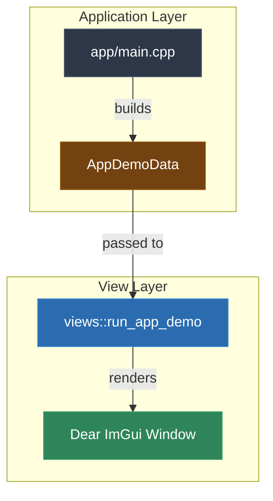

# Video & Blog Script: Phase 11 — UI-Driven Application Demo

> **Target Audience**: C++ Developers, Systems Engineers, and Software Architects  
> **Format**: Video Tutorial / Technical Blog Post Blueprint  
> **Topic**: Moving a Phase-Based C++ Demo from Console Startup Output into a Persistent Dear ImGui UI (Phase 11)

---

## 1. Executive Summary & Hook

### The "We Have a Window, But the App Still Behaves Like a CLI" Problem
After integrating Dear ImGui, it is easy to stop too early: the project has a window, but the real walkthrough still happens in `main.cpp` with eager startup execution and console logging.

That leaves us with the worst of both worlds:
- the app has a GUI dependency but still behaves like a fire-and-forget console demo;
- the application layer mixes orchestration with presentation;
- users cannot explore the demonstrations interactively.

### The Solution: A Persistent UI-Driven Demo Surface
Phase 11 turns the executable into a thin composition root and moves the demonstration surface into the `views` library:
1. **Prepared View Data**: `main.cpp` gathers the outputs of the existing phases into simple UI-facing data structures.
2. **Dedicated Application View**: `views::run_app_demo(...)` owns the Dear ImGui window, layout, and interaction model.
3. **Interactive Phase Navigation**: Buttons select which phase output to inspect instead of forcing readers through one linear startup stream.
4. **Persistent Runtime**: The window stays alive until the user closes it.

---

## 2. Architecture & Dependency Flow



### Key Architectural Invariants
- `app/main.cpp` no longer owns Dear ImGui widget construction.
- `libs/views` owns interaction flow, window lifetime, and panel layout.
- Demo outputs cross the boundary as plain data rather than streamed terminal text.

---

## 3. Step-by-Step Implementation Guide

### Step 1: Introduce a UI-Facing Data Model
**File**: `libs/views/include/views/app_demo_view.h`

```cpp
struct DemoUser final {
  std::int64_t id{0};
  std::string name;
  std::string email;
};

struct PhaseResult final {
  std::string title;
  std::vector<std::string> lines;
};

struct AppDemoData final {
  std::string project_version;
  std::string database_version;
  std::vector<DemoUser> users;
  std::vector<PhaseResult> phases;
};

int run_app_demo(const AppDemoData& data);
```

> **Voiceover / Blog Callout**:
> *"Notice the view layer is not reaching back into repositories or services. It receives prepared data and focuses purely on presentation and interaction."*

---

### Step 2: Build a Persistent Dear ImGui Window
**File**: `libs/views/src/app_demo_view.cpp`

The application demo window:
- creates a GLFW window;
- initializes Dear ImGui backends;
- renders a left-hand control panel of phase buttons;
- shows the currently selected phase on the right;
- stays open until the user closes the native window.

```cpp
while (!glfwWindowShouldClose(window)) {
  glfwPollEvents();
  ImGui_ImplOpenGL3_NewFrame();
  ImGui_ImplGlfw_NewFrame();
  ImGui::NewFrame();

  // Build persistent UI layout here

  ImGui::Render();
  ImGui_ImplOpenGL3_RenderDrawData(ImGui::GetDrawData());
  glfwSwapBuffers(window);
}
```

This is the key behavior change from the previous phase: the app no longer exits after a short fixed render loop.

---

### Step 3: Convert Console Results into View Data
**File**: `app/main.cpp`

Instead of printing every phase result directly, the application gathers them into `views::PhaseResult` records:

```cpp
views::PhaseResult phase3{
  .title = "Phase 3: Repository + Manual DI",
  .lines = {
      "Registered two users inside an explicit transaction.",
      "Total registered users: " + std::to_string(all_users.size()),
  },
};
```

The same pattern is used for phases 4 through 9, preserving the existing business behavior while changing the presentation surface.

---

### Step 4: Keep `main.cpp` as a Composition Root
**File**: `app/main.cpp`

The executable still wires repositories, services, factories, migrations, telemetry, and audit demonstrations together. But instead of rendering widgets or controlling UI lifetime, it now ends with:

```cpp
return views::run_app_demo(app_data);
```

That is the architectural win: application code prepares the scenario, and the `views` layer owns how it is presented.

---

## 4. Verification Criteria

1. Running the app opens a visible Dear ImGui application window.
2. The window remains open until the user closes it.
3. Buttons allow the user to switch between phase results interactively.
4. The phase output panel shows the prepared results for phases 3 through 9.
5. `app/main.cpp` no longer uses console output as the primary demo surface.

---

## 5. What Comes Next

After this phase, the next evolution is to stop precomputing every demonstration eagerly and instead let UI actions trigger selected workflows on demand through application-facing commands or presenters.
