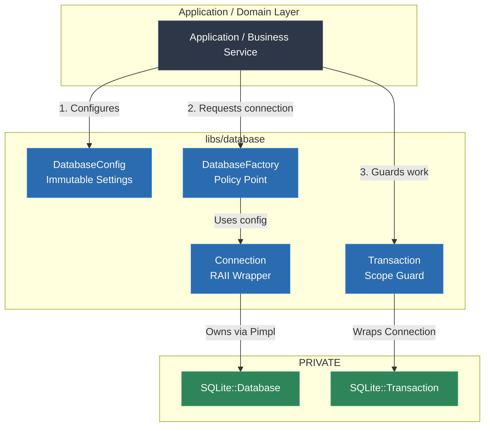

# Video & Blog Script: Phase 2 — Production Database Lifecycle (RAII, Transactions & Configuration)

> **Target Audience**: C++ Developers, Systems Engineers, and Software Architects  
> **Format**: Video Tutorial / Technical Blog Post Blueprint  
> **Topic**: Production Database Lifecycle Management: Configuration, RAII Connections, & Scope-Guarded Transactions (Phase 2)

---

## 1. Executive Summary & Hook

### The "Silent Data Corruption" Problem in C++
In naive database code, developers often create connection handles ad-hoc inside repository methods, execute SQL statements directly, and let the handle fall out of scope. This anti-pattern introduces severe production liabilities:
- **Inconsistent Connection Policy**: Pragmas like `PRAGMA foreign_keys = ON` or `PRAGMA busy_timeout` are applied sporadically or forgotten entirely.
- **Dangling / Uncommitted State**: When an exception is thrown midway through multi-statement updates, uncommitted state or partial writes corrupt database invariants.
- **Scattered Configuration**: Connection flags, file paths, and timeouts are hardcoded throughout business logic rather than managed centrally.

### The Solution: Explicit Lifecycle Architecture
Phase 2 establishes four core infrastructure components to guarantee safety:
1. **`DatabaseConfig`**: Immutable configuration value type managing connection paths, flags, foreign key enforcement, and busy timeouts.
2. **`Connection`**: RAII connection handle applying connection-scoped SQLite pragmas immediately upon bootstrap.
3. **`Transaction`**: Scope guard enforcing explicit `commit()` semantics and automatic rollback on exception exit.
4. **`DatabaseFactory`**: Centralized policy factory producing configured connection instances.

---

## 2. Architecture & Component Flow



### Key Architectural Invariants
- **Non-Copyable Connections & Transactions**: Duplicate handles suggest shared ownership; explicit move semantics ensure singular responsibility.
- **Non-Throwing Destructors**: `Transaction::~Transaction()` rolls back automatically if uncommitted without throwing, ensuring strict exception safety during stack unwinding.

---

## 3. Step-by-Step Implementation Guide

### Step 1: Centralized Database Configuration
**File**: `libs/database/include/database/database_config.h`

```cpp
#pragma once

#include <chrono>
#include <filesystem>
#include <string>

namespace database {

struct DatabaseConfig final {
  std::filesystem::path database_path{":memory:"};
  int open_flags{6};  // Default: OPEN_READWRITE (2) | OPEN_CREATE (4)
  std::chrono::milliseconds busy_timeout{5000};
  bool foreign_keys{true};
  bool wal_mode{false};
};

}  // namespace database
```

> **Voiceover / Blog Callout**:
> *"Using a value type for `DatabaseConfig` makes configuration trivial to copy, pass into services, or customize in unit tests without pointer ownership overhead."*

---

### Step 2: Connection Bootstrap & Pragma Application
**File**: `libs/database/src/database.cpp`

```cpp
#include "database/database.h"
#include <SQLiteCpp/Database.h>
#include "detail.h"

namespace database {

struct Connection::Impl {
  DatabaseConfig config;
  SQLite::Database db;

  explicit Impl(const DatabaseConfig& cfg)
      : config(cfg),
        db(cfg.database_path.string(), cfg.open_flags) {
    if (config.foreign_keys) {
      db.exec("PRAGMA foreign_keys = ON");
    }
    if (config.wal_mode && config.database_path != ":memory:") {
      db.exec("PRAGMA journal_mode = WAL");
    }
    if (config.busy_timeout.count() > 0) {
      db.exec("PRAGMA busy_timeout = " + std::to_string(config.busy_timeout.count()));
    }
  }
};

Connection::Connection(const DatabaseConfig& config)
    : impl_(std::make_unique<Impl>(config)) {}
```

> **Voiceover / Blog Callout**:
> *"In SQLite, PRAGMA settings like `foreign_keys` are connection-scoped. Applying them immediately during `Connection` construction guarantees every connection operates under consistent invariants."*

---

### Step 3: Scope-Guarded RAII Transaction
**Header**: `libs/database/include/database/transaction.h`  
**Implementation**: `libs/database/src/transaction.cpp`

```cpp
// Header snippet
namespace database {

class Transaction final {
 public:
  explicit Transaction(Connection& connection);
  ~Transaction();

  Transaction(const Transaction&) = delete;
  Transaction& operator=(const Transaction&) = delete;

  Transaction(Transaction&&) noexcept;
  Transaction& operator=(Transaction&&) noexcept;

  void commit();
  bool is_committed() const noexcept;

 private:
  struct Impl;
  std::unique_ptr<Impl> impl_;
};

}  // namespace database

// Source snippet
namespace database {

struct Transaction::Impl {
  SQLite::Transaction tx;
  bool committed{false};

  explicit Impl(Connection& conn)
      : tx(detail::get_native_db(conn)) {}
};

void Transaction::commit() {
  if (impl_ && !impl_->committed) {
    impl_->tx.commit();
    impl_->committed = true;
  }
}

}  // namespace database
```

> **Voiceover / Blog Callout**:
> *"Notice the exception safety model: `commit()` must be called explicitly. If an exception occurs or the block exits early, the destructor fires and automatically rolls back all changes, preventing partial writes."*

---

### Step 4: Factory Pattern Initialization
**Header**: `libs/database/include/database/database_factory.h`  
**Source**: `libs/database/src/database_factory.cpp`

```cpp
namespace database {

class DatabaseFactory final {
 public:
  static Connection create(const DatabaseConfig& config = DatabaseConfig{});
};

}  // namespace database
```

---

### Step 5: Comprehensive Lifecycle Tests
**File**: `tests/database/database_test.cpp`

```cpp
TEST(DatabaseLifecycleTest, TransactionHappyPathCommit) {
  database::DatabaseConfig config{.database_path = ":memory:"};
  database::Connection conn = database::DatabaseFactory::create(config);

  conn.execute("CREATE TABLE items (id INTEGER PRIMARY KEY, name TEXT NOT NULL)");

  {
    database::Transaction tx(conn);
    conn.execute("INSERT INTO items (name) VALUES ('Widget A')");
    tx.commit();
    EXPECT_TRUE(tx.is_committed());
  }

  const int count = conn.execute_scalar_int("SELECT COUNT(*) FROM items");
  EXPECT_EQ(count, 1);
}

TEST(DatabaseLifecycleTest, TransactionRollbackOnExceptionOrUncommitted) {
  database::Connection conn(":memory:");
  conn.execute("CREATE TABLE items (id INTEGER PRIMARY KEY, name TEXT NOT NULL)");

  try {
    database::Transaction tx(conn);
    conn.execute("INSERT INTO items (name) VALUES ('Temporary Item')");
    throw std::runtime_error("Simulated failure");
    tx.commit();
  } catch (const std::runtime_error&) {}

  const int count = conn.execute_scalar_int("SELECT COUNT(*) FROM items");
  EXPECT_EQ(count, 0); // Rollback verified
}
```

---

## 4. Common Pitfalls & Anti-Patterns

| Anti-Pattern | Why it Fails | Phase 2 Best Practice |
|---|---|---|
| Committing inside a destructor | Destructors must never throw; committing on destruction risks turning partial operations into success. | `commit()` must be an explicit action; destruction defaults to rollback. |
| Forgetting `PRAGMA foreign_keys` | SQLite disables foreign key checks by default for backward compatibility. | Enforce foreign key constraints automatically in `Connection` constructor. |
| Ad-hoc connection strings in repositories | Hardcodes file paths and flags in business logic; breaks unit testing. | Pass `DatabaseConfig` into `DatabaseFactory` / Connection instances. |
| Exposing raw driver handles in public API | Leaks driver specifics to domain code, preventing multi-engine abstraction. | Keep driver handles private using Pimpl and friend access helpers. |

---

## 5. Live Terminal Demo & Verification Cues

### Commands to Run On Screen / In Article
1. **Build Application and Test Suite**:
   ```bash
   cmake --build build
   ```
2. **Execute CTest Lifecycle Suite**:
   ```bash
   ctest --test-dir build --output-on-failure
   ```
   *Expected Output*: `100% tests passed out of 8`
3. **Run Demonstration Executable**:
   ```bash
   ./build/debug/app/app
   ```
   *Expected Output*:
   ```text
   TestProject 0.1.0
   Database module version 0.1.0
   Transaction 1 committed successfully.
   Simulating an error before commit...
   Caught expected exception during transaction: Database operational glitch
   Uncommitted transaction rolled back automatically on scope exit.
   Final account count in database: 2 (expected: 2)
   ```

---

## 6. Teaser for Phase 3

With robust lifecycle management, configuration, and RAII transactions established, we are ready for **Phase 3: Repository Pattern & Dependency Injection**.

In Phase 3, we will cover:
- Defining clean domain interfaces for data access (e.g., `UserRepository`).
- Implementing concrete SQLite repositories consuming `Connection` and `Transaction`.
- Decoupling domain models from database schemas using manual Dependency Injection.
