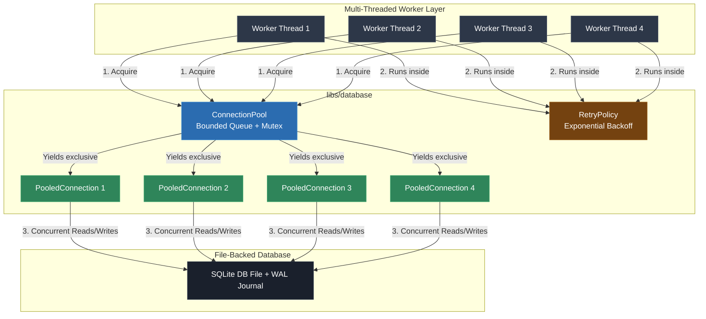

# Video & Blog Script: Phase 5 — Concurrency & Thread Safety (WAL Mode, Connection Pooling & Retry Policy)

> **Target Audience**: C++ Developers, Systems Engineers, and Software Architects  
> **Format**: Video Tutorial / Technical Blog Post Blueprint  
> **Topic**: Production Database Concurrency in C++: WAL Mode, Thread-Safe Connection Pooling, & Bounded Retries (Phase 5)

---

## 1. Executive Summary & Hook

### The "Database is Locked" Production Outage
A common myth in C++ application development is that *"SQLite handles multi-threading automatically"*. In reality, naive concurrent access models introduce crippling failures:
- **Global Handle Sharing**: Sharing a single `SQLite::Database` connection across worker threads leads to data race undefined behavior.
- **Uncontrolled Write Contention**: Multiple worker threads attempting write operations simultaneously trigger `SQLITE_BUSY` ("database is locked") crashes.
- **Infinite Retry Loops or Hangs**: Catching lock errors in infinite `while(true)` retry loops turns transient contention into CPU-spinning latency explosions.

### The Solution: Connection Ownership, WAL Mode & Bounded Retries
Phase 5 implements a production-grade concurrency model:
1. **Thread-Safe Connection Pool (`ConnectionPool`)**: Thread-safe pool providing exclusive connection ownership (`PooledConnection` scope guard) across worker threads.
2. **Write-Ahead Logging (WAL Mode)**: Enables concurrent readers and writers (`PRAGMA journal_mode = WAL`).
3. **Bounded Retry Policy (`RetryPolicy`)**: Executes exponential backoff retries for transient lock errors (`SQLITE_BUSY` / `TransientException`) while failing fast on permanent constraint violations (`ConflictException`).
4. **Multi-Worker Stress Testing**: GoogleTest multi-threading tests asserting data integrity under 8–32 worker thread contention.

---

## 2. Architecture & Concurrency Model



### Key Concurrency Invariants
- **Exclusive Connection Ownership**: A `Connection` handle is owned exclusively by **one** thread at a time via `PooledConnection`.
- **RAII Return Semantics**: When a `PooledConnection` goes out of scope, its destructor automatically returns the handle to the pool queue.
- **Selective Transient Retries**: Retries are attempted **only** for transient lock/busy errors; permanent constraint errors fail immediately.

---

## 3. Step-by-Step Implementation Guide

### Step 1: Thread-Safe Connection Pool
**Header**: `libs/database/include/database/concurrency/connection_pool.h`  
**Source**: `libs/database/src/concurrency/connection_pool.cpp`

```cpp
namespace database::concurrency {

class ConnectionPool final {
 public:
  class PooledConnection final {
   public:
    PooledConnection(std::unique_ptr<Connection> conn, ConnectionPool& pool)
        : conn_(std::move(conn)), pool_(&pool) {}

    ~PooledConnection() {
      if (conn_ && pool_) {
        pool_->return_connection(std::move(conn_));
      }
    }

    Connection& get() noexcept { return *conn_; }
    Connection* operator->() noexcept { return conn_.get(); }

   private:
    std::unique_ptr<Connection> conn_;
    ConnectionPool* pool_{nullptr};
  };

  PooledConnection acquire(std::chrono::milliseconds timeout = std::chrono::milliseconds(3000));
};

}  // namespace database::concurrency
```

> **Voiceover / Blog Callout**:
> *"The `PooledConnection` scope guard uses RAII to guarantee that connections are returned to the pool, even if an exception is thrown inside a worker thread."*

---

### Step 2: Bounded Retry Policy
**Header**: `libs/database/include/database/concurrency/retry_policy.h`

```cpp
template <typename Fn>
decltype(auto) execute(Fn&& operation, RetryStats* stats_out = nullptr) const {
  RetryStats local_stats{};
  for (int attempt = 1; ; ++attempt) {
    local_stats.attempts = attempt;
    try {
      return operation();
    } catch (const error::TransientException& ex) {
      if (attempt >= max_attempts_) throw;
      local_stats.retries++;
      std::this_thread::sleep_for(base_delay_ * attempt);
    } catch (const error::ConflictException& ex) {
      // Permanent unique constraint errors fail fast without retrying!
      throw;
    } catch (const std::exception& ex) {
      std::string msg(ex.what());
      if ((msg.find("busy") != std::string::npos || msg.find("locked") != std::string::npos) && attempt < max_attempts_) {
        local_stats.retries++;
        std::this_thread::sleep_for(base_delay_ * attempt);
      } else {
        throw;
      }
    }
  }
}
```

---

### Step 3: Multi-Worker Concurrency Stress Testing
**File**: `tests/database/database_test.cpp`

```cpp
TEST(ConcurrencyTest, MultiWorkerConcurrentReadsAndWrites) {
  const std::string db_file = "test_concurrent.db";
  database::DatabaseConfig config{
      .database_path = db_file,
      .busy_timeout = std::chrono::milliseconds(5000),
      .wal_mode = true,
  };

  database::concurrency::ConnectionPool pool(config, 4);
  database::concurrency::RetryPolicy retry(10, std::chrono::milliseconds(10));

  constexpr int num_workers = 8;
  constexpr int increments_per_worker = 10;
  std::atomic<int> successful_writes{0};

  std::vector<std::thread> workers;
  for (int w = 0; w < num_workers; ++w) {
    workers.emplace_back([&pool, &retry, &successful_writes]() {
      for (int i = 0; i < increments_per_worker; ++i) {
        auto conn = pool.acquire();
        retry.execute([&conn, &successful_writes]() {
          database::Transaction tx(conn.get());
          int current = conn->execute_scalar_int("SELECT val FROM counter WHERE id = 1");
          conn->execute("UPDATE counter SET val = " + std::to_string(current + 1) + " WHERE id = 1");
          tx.commit();
          successful_writes++;
        });
      }
    });
  }

  for (auto& t : workers) t.join();

  EXPECT_EQ(successful_writes.load(), num_workers * increments_per_worker);
}
```

> **Voiceover / Blog Callout**:
> *"Notice how 8 worker threads concurrently perform 80 write transactions against the same SQLite database file. By combining WAL mode, connection pooling, and bounded retries, 100% of transactions succeed with zero data corruption."*

---

### Step 4: Application Integration
**File**: `app/main.cpp`

```cpp
database::concurrency::ConnectionPool pool(concurrent_config, 4);
database::concurrency::RetryPolicy retry(3, std::chrono::milliseconds(10));

std::vector<std::thread> workers;
for (int w = 1; w <= 4; ++w) {
  workers.emplace_back([&pool, &retry, w]() {
    auto conn = pool.acquire();
    retry.execute([&conn, w]() {
      database::Transaction tx(conn.get());
      conn->execute("INSERT INTO audit_log (worker) VALUES ('Worker-" + std::to_string(w) + "')");
      tx.commit();
    });
  });
}

for (auto& t : workers) t.join();
```

---

## 4. Common Pitfalls & Anti-Patterns

| Anti-Pattern | Why it Fails | Phase 5 Best Practice |
|---|---|---|
| Sharing 1 `SQLite::Database` across threads | Violates thread safety rules; triggers memory corruption and crashes. | Give each worker thread exclusive ownership of a connection via `ConnectionPool`. |
| Retrying permanent errors (`ConflictException`) | Spins CPU retrying unique key collisions that will never succeed. | Filter error types: retry `TransientException` / lock errors; rethrow permanent constraint errors. |
| Forgetting `PRAGMA journal_mode = WAL` | In default DELETE mode, readers block writers and writers block readers. | Enable WAL mode for file-backed databases to allow concurrent reads and writes. |
| Unbounded retries without delay | Causes thread starvation and lock starvation explosions under heavy load. | Apply bounded attempt caps and linear/exponential delay (`base_delay * attempt`). |

---

## 5. Live Terminal Demo & Verification Cues

### Commands to Run On Screen / In Article
1. **Compile Application & Suite**:
   ```bash
   cmake --build build
   ```
2. **Execute Concurrency Suite (20 Total Tests)**:
   ```bash
   ctest --test-dir build --output-on-failure
   ```
   *Expected Output*: `100% tests passed out of 20` (including `ConnectionPoolTest`, `RetryPolicyTest`, and `ConcurrencyTest.MultiWorkerConcurrentReadsAndWrites`).
3. **Execute Application Binary**:
   ```bash
   ./build/debug/app/app
   ```
   *Expected Output*:
   ```text
   ================================------------------------
    Phase 5: Concurrency, Thread Safety & Connection Pool
   ================================------------------------
   ConnectionPool initialized with 4 PooledConnections in WAL mode.
   Dispatching 4 concurrent worker threads to write audit logs...
   Concurrent audit writes completed successfully. Total log entries: 4
   ```

---

## 6. Teaser for Phase 6

With high-concurrency database connection pooling and thread safety fully operational, we are ready for **Phase 6: Schema Migrations & Seeding Runner**.

In Phase 6, we will cover:
- Building an automated schema migration runner (`MigrationRunner`).
- Version-tracked schema evolution (`schema_migrations` table).
- Reproducible database seeding for local development and test environments.
