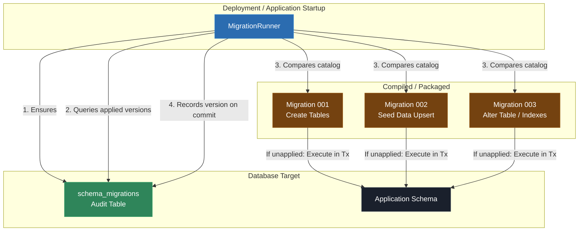

# Video & Blog Script: Phase 6 — Schema Evolution & Automated Seeding (Versioned Migration Runner)

> **Target Audience**: C++ Developers, Systems Engineers, and Software Architects  
> **Format**: Video Tutorial / Technical Blog Post Blueprint  
> **Topic**: Production Database Schema Evolution: Versioned Migrations, Idempotent Seeding, & Transactional DDL (Phase 6)

---

## 1. Executive Summary & Hook

### The "Startup `CREATE TABLE IF NOT EXISTS`" Trap
In naive C++ applications, schema initialization is often embedded directly in application startup using statements like `CREATE TABLE IF NOT EXISTS`. While this works for brand-new databases, it breaks down completely in production:
- **Schema Drift Across Environments**: Existing production databases need `ALTER TABLE`, column modifications, backfills, and new indexes that `CREATE TABLE IF NOT EXISTS` cannot apply.
- **Uncontrolled Deployment Invariants**: Without a versioned audit trail, there is no way to know which schema changes have been applied to a given production or staging instance.
- **Duplicate & Corrupted Seeding**: Re-running seed logic on application restart duplicates reference records or fails on constraint collisions.

### The Solution: Automated Versioned Migrations & Idempotent Upserts
Phase 6 introduces a production-grade schema migration runner:
1. **Monotonically Versioned Migrations (`Migration`)**: Ordered, immutable migration steps containing version numbers, descriptive names, checksums, and execution lambdas.
2. **Migration Audit Table (`schema_migrations`)**: Persistent database audit table tracking applied versions and timestamps.
3. **Transactional DDL Execution (`MigrationRunner`)**: Runs each unapplied migration step inside a dedicated database transaction (`Transaction`), rolling back cleanly on failure.
4. **Idempotent Reference Data Seeding**: Seeds initial reference data safely using `ON CONFLICT DO UPDATE` (upsert) syntax.

---

## 2. Architecture & Component Flow



### Key Architectural Invariants
- **Strict Monotonic Ordering**: Migration versions must be strictly increasing ($v1 < v2 < v3$).
- **Idempotent Migration Runner**: Re-running the runner against an up-to-date database is a sub-millisecond no-op.
- **Atomic Rollback on Error**: If Migration $N$ fails midway, its transaction rolls back completely without writing to `schema_migrations`.

---

## 3. Step-by-Step Implementation Guide

### Step 1: Migration Metadata & Catalog Structure
**File**: `libs/database/include/database/migration/migration.h`

```cpp
#pragma once

#include <cstdint>
#include <functional>
#include <string>

namespace database { class Connection; }

namespace database::migration {

struct Migration final {
  std::int64_t version{0};
  std::string name;
  std::string checksum;
  std::function<void(Connection&)> apply;
};

}  // namespace database::migration
```

---

### Step 2: Versioned Migration Runner Implementation
**Header**: `libs/database/include/database/migration/migration_runner.h`  
**Source**: `libs/database/src/migration/migration_runner.cpp`

```cpp
void MigrationRunner::run(Connection& conn, const std::vector<Migration>& catalog) {
  ensure_history_table(conn);

  // Validate monotonic version ordering
  for (std::size_t i = 1; i < catalog.size(); ++i) {
    if (catalog[i].version <= catalog[i - 1].version) {
      throw error::DatabaseException("Migration catalog error: versions must be strictly monotonic", error::EngineType::SQLite);
    }
  }

  for (const auto& m : catalog) {
    int count = conn.execute_scalar_int("SELECT COUNT(*) FROM schema_migrations WHERE version = " + std::to_string(m.version));
    if (count > 0) {
      continue; // Skip already applied migrations
    }

    // Execute step inside an isolated transaction
    {
      Transaction tx(conn);
      m.apply(conn);
      conn.execute("INSERT INTO schema_migrations (version, name, checksum) VALUES (" +
                   std::to_string(m.version) + ", '" + m.name + "', '" + m.checksum + "')");
      tx.commit();
    }
  }
}
```

> **Voiceover / Blog Callout**:
> *"Notice the transactional boundary: `m.apply(conn)` and the record insertion into `schema_migrations` occur inside the same transaction scope `Transaction tx(conn)`. If the step fails, no trace is written to `schema_migrations`."*

---

### Step 3: Automated Migration & Seeding Unit Tests
**File**: `tests/database/database_test.cpp`

```cpp
TEST(MigrationRunnerTest, SequentialMigrationAndIdempotentExecution) {
  database::Connection conn(":memory:");
  database::migration::MigrationRunner runner;

  std::vector<database::migration::Migration> catalog = {
      {1, "create_roles_table", "chk1", [](database::Connection& c) {
         c.execute("CREATE TABLE roles (id INTEGER PRIMARY KEY, name TEXT UNIQUE NOT NULL)");
       }},
      {2, "seed_initial_roles", "chk2", [](database::Connection& c) {
         c.execute("INSERT INTO roles (id, name) VALUES (1, 'Admin') ON CONFLICT(id) DO UPDATE SET name=excluded.name");
         c.execute("INSERT INTO roles (id, name) VALUES (2, 'User') ON CONFLICT(id) DO UPDATE SET name=excluded.name");
       }},
      {3, "add_description_column", "chk3", [](database::Connection& c) {
         c.execute("ALTER TABLE roles ADD COLUMN description TEXT DEFAULT ''");
       }},
  };

  // First run: applies 3 migrations
  runner.run(conn, catalog);
  EXPECT_EQ(conn.execute_scalar_int("SELECT COUNT(*) FROM schema_migrations"), 3);

  // Second run: idempotent no-op
  runner.run(conn, catalog);
  EXPECT_EQ(conn.execute_scalar_int("SELECT COUNT(*) FROM schema_migrations"), 3);
}

TEST(MigrationRunnerTest, TransactionalRollbackOnMigrationFailure) {
  database::Connection conn(":memory:");
  database::migration::MigrationRunner runner;

  std::vector<database::migration::Migration> catalog = {
      {1, "valid_step", "chk1", [](database::Connection& c) { c.execute("CREATE TABLE valid_table (id INT)"); }},
      {2, "failing_step", "chk2", [](database::Connection& c) {
         c.execute("CREATE TABLE failing_table (id INT)");
         throw std::runtime_error("Simulated migration failure");
       }},
  };

  EXPECT_THROW(runner.run(conn, catalog), std::exception);

  // Step 1 committed, Step 2 cleanly rolled back
  EXPECT_EQ(conn.execute_scalar_int("SELECT COUNT(*) FROM schema_migrations WHERE version = 1"), 1);
  EXPECT_EQ(conn.execute_scalar_int("SELECT COUNT(*) FROM schema_migrations WHERE version = 2"), 0);
  EXPECT_THROW(conn.execute("SELECT COUNT(*) FROM failing_table"), std::exception);
}
```

---

### Step 4: Application Integration
**File**: `app/main.cpp`

```cpp
database::Connection migration_conn(":memory:");
database::migration::MigrationRunner migration_runner;

std::vector<database::migration::Migration> migration_catalog = {
    {1, "001_create_system_config", "v1.0", [](database::Connection& c) {
       c.execute("CREATE TABLE system_config (key TEXT PRIMARY KEY, val TEXT NOT NULL)");
     }},
    {2, "002_seed_default_settings", "v1.1", [](database::Connection& c) {
       c.execute("INSERT INTO system_config (key, val) VALUES ('site_name', 'TestProject Pro') ON CONFLICT(key) DO UPDATE SET val=excluded.val");
       c.execute("INSERT INTO system_config (key, val) VALUES ('max_workers', '8') ON CONFLICT(key) DO UPDATE SET val=excluded.val");
     }},
    {3, "003_add_description_column", "v1.2", [](database::Connection& c) {
       c.execute("ALTER TABLE system_config ADD COLUMN description TEXT DEFAULT ''");
     }},
};

std::cout << "Running automated migration pipeline...\n";
migration_runner.run(migration_conn, migration_catalog);
```

---

## 4. Common Pitfalls & Anti-Patterns

| Anti-Pattern | Why it Fails | Phase 6 Best Practice |
|---|---|---|
| Editing an already-applied migration | Mutates past migration history; breaks existing databases in production. | Migrations are immutable! Always add a new versioned step ($v+1$) for schema changes. |
| Unversioned `CREATE TABLE IF NOT EXISTS` | Fails to alter existing columns, create indexes, or perform data backfills. | Use a monotonically increasing version catalog ($v1, v2, v3$). |
| Non-idempotent seed scripts (`INSERT`) | Fails or duplicates records on second deployment. | Use upsert syntax (`ON CONFLICT(key) DO UPDATE SET ...`) for seed data. |
| Running migrations inside every app instance | Causes race conditions in horizontally scaled clusters. | Run migrations via CI/CD deployment pipelines or lock migration execution. |

---

## 5. Live Terminal Demo & Verification Cues

### Commands to Run On Screen / In Article
1. **Compile Application & Suite**:
   ```bash
   cmake --build build
   ```
2. **Execute CTest Migration Suite (22 Total Tests)**:
   ```bash
   ctest --test-dir build --output-on-failure
   ```
   *Expected Output*: `100% tests passed out of 22` (including `MigrationRunnerTest.SequentialMigrationAndIdempotentExecution` and `MigrationRunnerTest.TransactionalRollbackOnMigrationFailure`).
3. **Execute Application Binary**:
   ```bash
   ./build/debug/app/app
   ```
   *Expected Output*:
   ```text
   ================================------------------------
    Phase 6: Schema Evolution & Versioned Migration Runner
   ================================------------------------
   Running automated migration pipeline (3 versioned migrations)...
   Schema migration complete. Current Schema Version: v3, Config entries seeded: 2
   ```

---

## 6. Teaser for Phase 7

Now that our database schema is fully deterministic and versioned across deployments, we are ready for **Phase 7: Query Builder & Struct Mapping Layer**.

In Phase 7, we will cover:
- Type-safe query building and SQL clause generation.
- Automated row-to-struct mapping primitives.
- Eliminating boilerplate positional column reading (`getColumn(0).getInt64()`).
