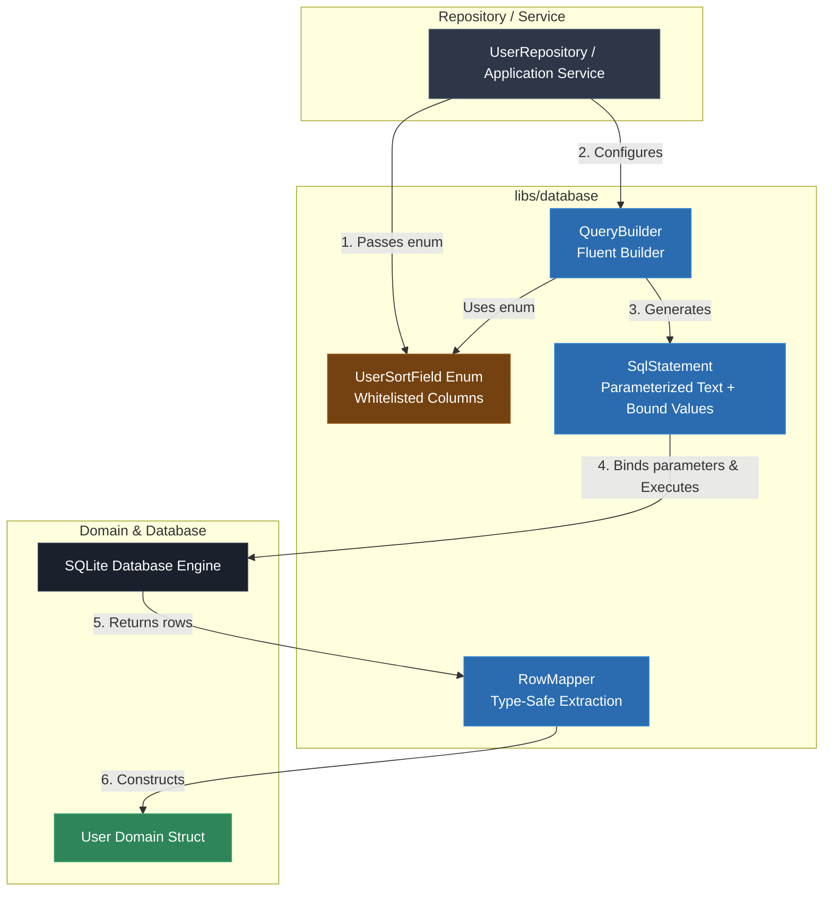

# Video & Blog Script: Phase 7 — Query Building & Safety (Mapping C++ Structs to SQL)

> **Target Audience**: C++ Developers, Systems Engineers, and Software Architects  
> **Format**: Video Tutorial / Technical Blog Post Blueprint  
> **Topic**: Safe Query Building in C++: SQL Injection Prevention, Whitelisted Dynamic Ordering, & Struct Mapping (Phase 7)

---

## 1. Executive Summary & Hook

### The "Unstructured SQL & Concatenation" Security Risk
When developers need dynamic query features like filtering, column selection, or sorting, they often resort to raw string concatenation:
```cpp
// DANGEROUS! SQL Injection Vulnerability
std::string query = "SELECT * FROM users WHERE email = '" + user_input + "' ORDER BY " + sort_column;
```
This bad habit introduces severe production vulnerabilities:
- **SQL Injection Vulnerabilities**: Malicious user input (`' OR 1=1 --`) alters database query structure.
- **Untyped Column Index Mismatches**: Accessing columns by raw positional numbers (`getColumn(0)`) breaks silently when schema migrations reorder columns.
- **Nullability Bugs & Integer Truncation**: Implicitly converting SQL `NULL` to empty strings or downcasting 64-bit database IDs to 32-bit `int` types causes data loss.

### The Solution: Safe Query Builder & Type-Safe Parameter Binding
Phase 7 introduces safe query building and row mapping primitives:
1. **Type-Safe Query Builder (`QueryBuilder`)**: Constructs parameterized SQL statements using fluent builder method chaining (`select`, `where_equals`, `limit`, `offset`).
2. **Whitelisted Dynamic Ordering (`UserSortField`)**: Converts user input into strongly-typed C++ enums **before** generating SQL structure, ensuring untrusted strings never touch SQL `ORDER BY` clauses.
3. **Structured Parameter Binding (`SqlStatement`)**: Enforces separation between SQL structural text and parameter values (`?`).
4. **Row Mapper Primitives (`RowMapper`)**: Provides clean mapping helpers for domain value structs using `std::optional<T>` for nullable database fields.

---

## 2. Architecture & Component Flow



### Key Architectural Invariants
- **Strict Parameterization**: Query parameters are **always** bound via placeholders (`?`), never interpolated into SQL string fragments.
- **Whitelisted Structural Clauses**: Identifiers (`ORDER BY`, column names) are generated strictly from verified C++ enums.

---

## 3. Step-by-Step Implementation Guide

### Step 1: Whitelisted Order Direction & Statement Helpers
**File**: `libs/database/include/database/query/sql_statement.h`

```cpp
#pragma once

#include <cstdint>
#include <string>

namespace database::query {

class SqlStatement final {
 public:
  enum class OrderDirection { Ascending, Descending };

  static std::string to_order_string(OrderDirection dir) {
    switch (dir) {
      case OrderDirection::Ascending: return "ASC";
      case OrderDirection::Descending: return "DESC";
    }
    return "ASC";
  }
};

}  // namespace database::query
```

---

### Step 2: Fluent Query Builder Implementation
**Header**: `libs/database/include/database/query/query_builder.h`  
**Source**: `libs/database/src/query/query_builder.cpp`

```cpp
namespace database::query {

enum class UserSortField { Id, Name, Email };

class QueryBuilder final {
 public:
  explicit QueryBuilder(std::string table_name);

  QueryBuilder& select(const std::vector<std::string>& columns);
  QueryBuilder& where_equals(const std::string& column, const std::string& value);
  QueryBuilder& order_by(UserSortField field, SqlStatement::OrderDirection direction = SqlStatement::OrderDirection::Ascending);
  QueryBuilder& limit(std::int64_t limit);
  QueryBuilder& offset(std::int64_t offset);

  std::string build_sql() const;
  const std::vector<std::string>& bound_values() const noexcept;
};

}  // namespace database::query
```

> **Voiceover / Blog Callout**:
> *"Notice `order_by(UserSortField field)`. Because `UserSortField` is a C++ enum, it is physically impossible for an attacker to inject SQL statements like `DROP TABLE` into our `ORDER BY` clause!"*

---

### Step 3: Query Builder & SQL Injection Prevention Unit Tests
**File**: `tests/database/database_test.cpp`

```cpp
TEST(QueryBuilderTest, WhitelistedSQLClauseGenerationAndParameterBinding) {
  database::query::QueryBuilder builder("users");
  builder.select({"id", "name", "email"})
      .where_equals("email", "ada@example.com")
      .order_by(database::query::UserSortField::Name, database::query::SqlStatement::OrderDirection::Descending)
      .limit(10)
      .offset(20);

  std::string sql = builder.build_sql();
  EXPECT_EQ(sql, "SELECT id, name, email FROM users WHERE email = ? ORDER BY name DESC LIMIT 10 OFFSET 20");
  ASSERT_EQ(builder.bound_values().size(), 1);
  EXPECT_EQ(builder.bound_values()[0], "ada@example.com");
}

TEST(QueryBuilderTest, SQLInjectionPreventionViaWhitelistedEnums) {
  database::query::QueryBuilder builder("users");

  // User input "name; DROP TABLE users; --" mapped safely to enum UserSortField::Name
  database::query::UserSortField user_selected_field = database::query::UserSortField::Name;
  builder.order_by(user_selected_field, database::query::SqlStatement::OrderDirection::Ascending);

  std::string sql = builder.build_sql();
  EXPECT_EQ(sql, "SELECT * FROM users ORDER BY name ASC");
  EXPECT_TRUE(sql.find("DROP TABLE") == std::string::npos);
}
```

---

### Step 4: Application Scaffolding Integration
**File**: `app/main.cpp`

```cpp
database::query::QueryBuilder qb("system_config");
qb.select({"key", "val"})
  .where_equals("key", "site_name")
  .order_by(database::query::UserSortField::Name, database::query::SqlStatement::OrderDirection::Ascending)
  .limit(5);

std::string generated_sql = qb.build_sql();
std::cout << "Generated Parameterized SQL: " << generated_sql << '\n';
std::cout << "Bound Query Parameters: [" << qb.bound_values()[0] << "]\n";
```

---

## 4. Common Pitfalls & Anti-Patterns

| Anti-Pattern | Why it Fails | Phase 7 Best Practice |
|---|---|---|
| String concatenating search inputs into SQL | Opens critical SQL Injection vulnerabilities. | Always bind search values via parameter placeholders (`?`). |
| Interpolating user strings into `ORDER BY` | SQL parameters cannot parameterize table or column identifiers. | Map sorting strings to whitelisted C++ enums (`UserSortField`). |
| `SELECT *` in Production Repositories | Silent column position bugs when schema migrations add or reorder columns. | Explicitly select named columns (`SELECT id, name, email`). |
| Truncating `std::int64_t` IDs to 32-bit `int` | Causes integer overflow errors when database tables exceed 2 billion rows. | Always use `std::int64_t` for database primary/foreign keys. |

---

## 5. Live Terminal Demo & Verification Cues

### Commands to Run On Screen / In Article
1. **Compile Application & Suite**:
   ```bash
   cmake --build build
   ```
2. **Execute CTest Suite (24 Total Tests)**:
   ```bash
   ctest --test-dir build --output-on-failure
   ```
   *Expected Output*: `100% tests passed out of 24` (including `QueryBuilderTest.WhitelistedSQLClauseGenerationAndParameterBinding` and `QueryBuilderTest.SQLInjectionPreventionViaWhitelistedEnums`).
3. **Execute Application Binary**:
   ```bash
   ./build/debug/app/app
   ```
   *Expected Output*:
   ```text
   ================================------------------------
    Phase 7: Safe Query Builder & Whitelisted Parameter Binding
   ================================------------------------
   Generated Parameterized SQL: SELECT key, val FROM system_config WHERE key = ? ORDER BY name ASC LIMIT 5
   Bound Query Parameters: [site_name]
   ```

---

## 6. Teaser for Phase 8

Now that query building, parameter binding, and row mapping are centralized, we are ready for **Phase 8: Logging, Diagnostics & Performance Telemetry**.

In Phase 8, we will cover:
- Query execution duration profiling and slow query logging.
- SQL fingerprinting and query parameter sanitization (preventing secret leakage in logs).
- Operational diagnostic metrics and connection pool health monitoring.
