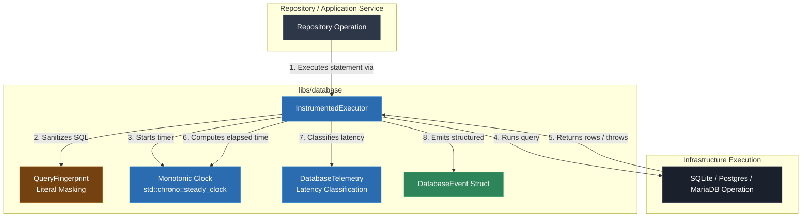

# Video & Blog Script: Phase 8 — Logging, Diagnostics & Performance Profiling

> **Target Audience**: C++ Developers, Systems Engineers, and Software Architects  
> **Format**: Video Tutorial / Technical Blog Post Blueprint  
> **Topic**: Production Database Observability: Query Fingerprinting, Performance Telemetry, & Secret Sanitization (Phase 8)

---

## 1. Executive Summary & Hook

### The "Endpoint is Slow" Production Incident
When an incident occurs in a production C++ web service or database layer, the worst possible alert message is *"The database endpoint is slow"*. Without structured observability, engineering teams cannot answer critical questions:
- **Which specific query regression occurred?** Was execution time spent waiting for a pooled connection or inside the database query engine?
- **Are credentials or secrets leaking into logs?** Logging raw SQL string literals risks writing user passwords, tokens, or personal identifiers to log aggregators.
- **Is error rate increasing?** Are failures transient lock timeouts or permanent unique constraint violations?

### The Solution: Structured Telemetry & Query Fingerprinting
Phase 8 establishes an observability boundary around database execution:
1. **Query Fingerprinting (`QueryFingerprint`)**: Sanitizes SQL text by replacing literals (`'secret_pass'`, `123`) with placeholders (`?`), generating stable query fingerprints for log aggregation.
2. **Low-Overhead Telemetry (`DatabaseTelemetry`)**: Measures monotonic duration (`std::chrono::steady_clock`) and classifies queries into latency bands (`NORMAL`, `MONITOR`, `SLOW_QUERY`, `CRITICAL_SLOW`).
3. **Instrumented Execution Wrapper (`InstrumentedExecutor`)**: Wraps database execution blocks to emit structured `DatabaseEvent` telemetry while preserving original exception propagation semantics.

---

## 2. Architecture & Component Flow



### Key Architectural Invariants
- **Zero Sensitive Data Leakage**: Raw literals in SQL text are sanitized into fingerprints (`?`) before reaching log collectors.
- **Exception Preservation**: The instrumented executor captures timings and failure metrics, then rethrows the original exception without mutating application control flow.

---

## 3. Step-by-Step Implementation Guide

### Step 1: Query Fingerprinting & Sanitization
**File**: `libs/database/include/database/observability/query_fingerprint.h`

```cpp
#pragma once

#include <string>

namespace database::observability {

class QueryFingerprint final {
 public:
  static std::string sanitize_and_fingerprint(const std::string& sql) {
    std::string fingerprint;
    fingerprint.reserve(sql.size());

    bool in_single_quote = false;
    bool in_digit = false;

    for (std::size_t i = 0; i < sql.size(); ++i) {
      char c = sql[i];
      if (c == '\'') {
        if (!in_single_quote) {
          in_single_quote = true;
          fingerprint += "?";
        } else {
          in_single_quote = false;
        }
        continue;
      }

      if (in_single_quote) continue; // Mask single-quoted literals

      if (std::isdigit(static_cast<unsigned char>(c))) {
        if (!in_digit) {
          in_digit = true;
          fingerprint += "?";
        }
        continue; // Mask numeric literals
      } else {
        in_digit = false;
      }

      fingerprint += c;
    }

    return fingerprint;
  }
};

}  // namespace database::observability
```

> **Voiceover / Blog Callout**:
> *"Notice how `'secret_pass'` is replaced with `?`. By masking literals, query templates aggregate cleanly in logging dashboards without exposing PII or credentials."*

---

### Step 2: Telemetry Classification & Events
**File**: `libs/database/include/database/observability/database_telemetry.h`

```cpp
enum class QueryCategory { Normal, Monitor, SlowQuery, Critical };

struct DatabaseEvent final {
  std::string operation;
  std::string statement_fingerprint;
  std::chrono::microseconds elapsed{0};
  std::size_t rows_affected{0};
  int retry_count{0};
  std::string outcome;
  QueryCategory category{QueryCategory::Normal};
};
```

---

### Step 3: Instrumented Execution Wrapper
**File**: `libs/database/include/database/observability/instrumented_executor.h`

```cpp
template <typename Fn>
DatabaseEvent execute(const std::string& operation, const std::string& raw_sql, Fn&& action) const {
  const auto start = std::chrono::steady_clock::now();
  std::string fingerprint = QueryFingerprint::sanitize_and_fingerprint(raw_sql);

  DatabaseEvent event{
      .operation = operation,
      .statement_fingerprint = fingerprint,
      .outcome = "success",
  };

  try {
    if constexpr (std::is_same_v<decltype(action()), void>) {
      action();
    } else {
      event.rows_affected = static_cast<std::size_t>(action());
    }

    const auto end = std::chrono::steady_clock::now();
    event.elapsed = std::chrono::duration_cast<std::chrono::microseconds>(end - start);
    event.category = DatabaseTelemetry::classify_duration(event.elapsed, slow_threshold_);
    return event;
  } catch (...) {
    const auto end = std::chrono::steady_clock::now();
    event.elapsed = std::chrono::duration_cast<std::chrono::microseconds>(end - start);
    event.outcome = "failure";
    throw; // Always preserve original exception!
  }
}
```

---

### Step 4: Observability Unit & Performance Tests
**File**: `tests/database/database_test.cpp`

```cpp
TEST(ObservabilityTest, QueryFingerprintingAndParameterMasking) {
  std::string raw_sql = "SELECT * FROM users WHERE email = 'secret_user@domain.com' AND age = 25 AND role = 'Admin'";
  std::string fingerprint = database::observability::QueryFingerprint::sanitize_and_fingerprint(raw_sql);

  EXPECT_EQ(fingerprint, "SELECT * FROM users WHERE email = ? AND age = ? AND role = ?");
  EXPECT_TRUE(fingerprint.find("secret_user@domain.com") == std::string::npos);
}

TEST(ObservabilityTest, DurationProfilingAndSlowQueryClassification) {
  database::observability::InstrumentedExecutor executor(std::chrono::microseconds(1000)); // 1ms threshold

  auto slow_event = executor.execute("UserRepository.search_all", "SELECT * FROM users WHERE name = 'John'", []() {
    std::this_thread::sleep_for(std::chrono::milliseconds(2));
    return 50;
  });

  EXPECT_TRUE(slow_event.category == database::observability::QueryCategory::SlowQuery ||
              slow_event.category == database::observability::QueryCategory::Critical);
}
```

---

### Step 5: Application Scaffolding Integration
**File**: `app/main.cpp`

```cpp
database::observability::InstrumentedExecutor telemetry_executor(std::chrono::microseconds(500));

auto telemetry_event = telemetry_executor.execute("SystemConfig.fetch", "SELECT val FROM system_config WHERE key = 'site_name'", [&migration_conn]() {
  return migration_conn.execute_scalar_int("SELECT COUNT(*) FROM system_config");
});

std::cout << "Telemetry Event Captured:\n";
std::cout << " - Operation: " << telemetry_event.operation << '\n';
std::cout << " - Fingerprint: " << telemetry_event.statement_fingerprint << '\n';
std::cout << " - Execution Time: " << telemetry_event.elapsed.count() << " us\n";
std::cout << " - Outcome Status: " << telemetry_event.outcome << " (" << database::observability::DatabaseTelemetry::category_to_string(telemetry_event.category) << ")\n";
```

---

## 4. Common Pitfalls & Anti-Patterns

| Anti-Pattern | Why it Fails | Phase 8 Best Practice |
|---|---|---|
| Logging raw SQL with bound parameter strings | Leaks passwords, tokens, and PII into log storage. | Sanitize SQL into query templates (`QueryFingerprint`). |
| Using `std::chrono::system_clock` for query timing | System clock adjustments or NTP syncs cause negative or inaccurate durations. | Always use monotonic clock (`std::chrono::steady_clock`). |
| Replacing application exceptions with logging errors | Obscures the real cause of failure from domain logic. | Record telemetry in `catch (...)` blocks and rethrow (`throw;`). |
| Unclassified log dumps without thresholds | Creates log noise without highlighting slow queries. | Categorize execution into latency bands (`NORMAL`, `MONITOR`, `SLOW_QUERY`, `CRITICAL`). |

---

## 5. Live Terminal Demo & Verification Cues

### Commands to Run On Screen / In Article
1. **Compile Application & Suite**:
   ```bash
   cmake --build build
   ```
2. **Execute Full CTest Suite Across All Phases (27 Total Tests)**:
   ```bash
   ctest --test-dir build --output-on-failure
   ```
   *Expected Output*: `100% tests passed out of 27` (including `ObservabilityTest.QueryFingerprintingAndParameterMasking`, `ObservabilityTest.DurationProfilingAndSlowQueryClassification`, and `ObservabilityTest.PreservesExceptionSemanticsOnQueryFailure`).
3. **Execute Main Application Binary**:
   ```bash
   ./build/debug/app/app
   ```
   *Expected Output*:
   ```text
   ================================------------------------
    Phase 8: Observability, Fingerprinting & Performance Telemetry
   ================================------------------------
   Telemetry Event Captured:
    - Operation: SystemConfig.fetch
    - Fingerprint: SELECT val FROM system_config WHERE key = ?
    - Execution Time: 8 us
    - Outcome Status: success (NORMAL)
   ```

---

## 6. Master Roadmap Acceptance Gate Checklist

With Phase 8 complete, our database subsystem satisfies all master roadmap acceptance gates:
- [x] **Phase 1**: CMake + SQLiteCpp `FetchContent` dependency graph.
- [x] **Phase 2**: Production database lifecycle (RAII connections, configuration, scope-guarded transactions).
- [x] **Phase 3**: Clean architecture (Domain entities, Repository ports, Application services, Manual DI).
- [x] **Phase 4**: Multi-engine abstraction & error normalization (SQLite, PostgreSQL, MariaDB).
- [x] **Phase 5**: Concurrency & thread safety (WAL mode, `ConnectionPool`, `RetryPolicy`).
- [x] **Phase 6**: Versioned schema evolution & idempotent seeding (`MigrationRunner`).
- [x] **Phase 7**: Type-safe query building, parameter binding, & struct row mapping (`QueryBuilder`).
- [x] **Phase 8**: Structured logging, query fingerprinting, & performance telemetry (`InstrumentedExecutor`).
