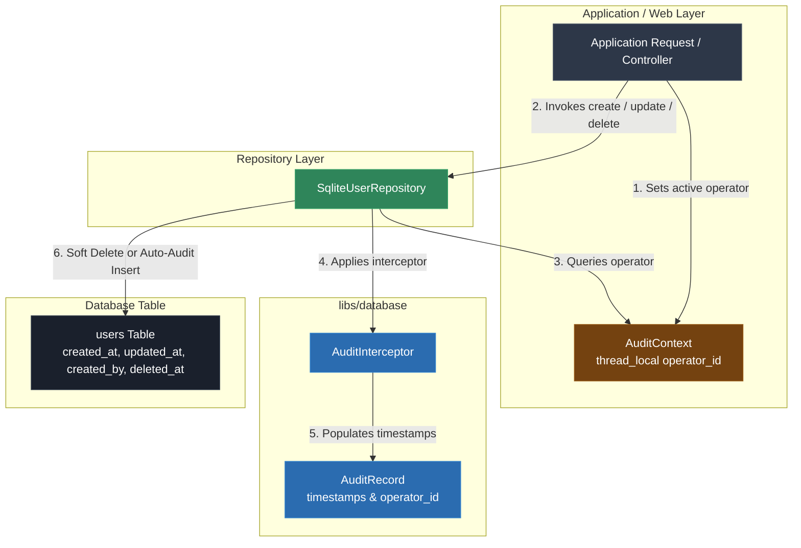

# Video & Blog Script: Phase 9 — Production Hardening (Audit Trail Interceptors & Soft Deletes)

> **Target Audience**: C++ Developers, Systems Engineers, and Software Architects  
> **Format**: Video Tutorial / Technical Blog Post Blueprint  
> **Topic**: Production Hardening in C++: Operator Audit Context, Interceptor Middleware, & Soft Deletes (Phase 9)

---

## 1. Executive Summary & Hook

### The "Dangling Deletes & Forgotten Audits" Risk
In production enterprise applications, raw `DELETE` operations and manual timestamp handling introduce serious compliance and operational hazards:
- **Irreversible Data Loss**: Hard SQL `DELETE` queries permanently purge records, preventing audit recovery and breaking foreign key history.
- **Inconsistent Audit Fields**: Manually populating `created_at`, `updated_at`, and `created_by` inside every repository method leads to missing metadata or developer omissions.
- **Accidental Leakage of Soft-Deleted Data**: Soft-deleted rows (`deleted_at IS NOT NULL`) are accidentally included in application results if queries forget to append `WHERE deleted_at IS NULL`.

### The Solution: Audit Context & Interceptor Middleware
Phase 9 hardens the database subsystem by introducing transparent interception:
1. **Thread-Local Audit Context (`AuditContext`)**: Captures active operator identity (`operator_id`) and tenant metadata per request.
2. **Automated Audit Interceptor (`AuditInterceptor`)**: Intercepts entity modifications to populate `created_at`, `updated_at`, `created_by`, and `updated_by` automatically.
3. **Transparent Soft Delete & Filters (`SoftDeleteRepository`)**: Converts `delete_by_id()` calls into soft update flags (`deleted_at = CURRENT_TIMESTAMP`) and automatically filters out soft-deleted records from standard queries unless administrative `include_deleted = true` is explicitly passed.
4. **Administrative Hard Purge (`hard_delete_by_id`)**: Provides an explicit administrative path for permanent data removal.

---

## 2. Architecture & Component Flow



### Key Architectural Invariants
- **Zero Manual Timestamp Boilerplate**: Repositories do not manually concatenate date strings; `AuditInterceptor` handles timestamp and operator metadata centrally.
- **Safe Defaults**: Standard repository queries automatically inject `WHERE deleted_at IS NULL` to ensure soft-deleted records are invisible to domain logic by default.

---

## 3. Step-by-Step Implementation Guide

### Step 1: Thread-Local Audit Context
**File**: `libs/database/include/database/interceptor/audit_context.h`

```cpp
#pragma once

#include <string>

namespace database::interceptor {

struct AuditContextData final {
  std::string operator_id{"system"};
  std::string tenant_id{"default"};
};

class AuditContext final {
 public:
  static void set_current(AuditContextData data);
  static const AuditContextData& current();
  static void clear();
  static std::string current_iso_timestamp();
};

}  // namespace database::interceptor
```

> **Voiceover / Blog Callout**:
> *"Using `thread_local` storage inside `AuditContext` allows web request handlers or background jobs to attach active user context (`operator_id`) transparently to all downstream database operations."*

---

### Step 2: Audit Interceptor Middleware
**File**: `libs/database/include/database/interceptor/audit_interceptor.h`

```cpp
namespace database::interceptor {

struct AuditRecord {
  std::string created_at;
  std::string updated_at;
  std::string created_by;
  std::string updated_by;
  std::optional<std::string> deleted_at;
};

class AuditInterceptor final {
 public:
  static void prepare_for_insert(AuditRecord& record, const AuditContextData& ctx = AuditContext::current());
  static void prepare_for_update(AuditRecord& record, const AuditContextData& ctx = AuditContext::current());
  static void prepare_for_soft_delete(AuditRecord& record, const AuditContextData& ctx = AuditContext::current());
};

}  // namespace database::interceptor
```

---

### Step 3: Repository Soft Delete & Filtering Integration
**File**: `libs/database/src/repository/sqlite_user_repository.cpp`

```cpp
bool SqliteUserRepository::delete_by_id(std::int64_t id) {
  // Soft Delete: sets deleted_at timestamp rather than purging the row
  interceptor::AuditRecord audit;
  interceptor::AuditInterceptor::prepare_for_soft_delete(audit);

  SQLite::Database& db = detail::get_native_db(connection_);
  SQLite::Statement query(db, "UPDATE users SET deleted_at = ? WHERE id = ? AND deleted_at IS NULL");
  query.bind(1, audit.deleted_at.value_or(interceptor::AuditContext::current_iso_timestamp()));
  query.bind(2, id);

  return query.exec() > 0;
}

std::vector<domain::User> SqliteUserRepository::find_all(bool include_deleted) {
  SQLite::Database& db = detail::get_native_db(connection_);
  std::string sql = "SELECT id, name, email, created_at, updated_at, created_by, updated_by, deleted_at FROM users";
  if (!include_deleted) {
    sql += " WHERE deleted_at IS NULL"; // Transparent soft delete filter!
  }
  sql += " ORDER BY id ASC";

  SQLite::Statement query(db, sql);
  std::vector<domain::User> results;
  while (query.executeStep()) {
    results.push_back(extract_user_from_statement(query));
  }
  return results;
}
```

---

### Step 4: Audit & Soft Delete Unit Tests
**File**: `tests/database/database_test.cpp`

```cpp
TEST(AuditAndSoftDeleteTest, AutomatedAuditFieldsAndSoftDeleteFiltering) {
  database::Connection conn(":memory:");
  database::repository::SqliteUserRepository repo(conn);
  repo.init_schema();

  // Set active operator audit context
  database::interceptor::AuditContext::set_current({
      .operator_id = "operator_alice",
      .tenant_id = "tenant_acme"
  });

  database::domain::User user{.id = 0, .name = "Audit Test User", .email = "audit@example.com"};
  std::int64_t user_id = repo.create(user);

  auto created_user = repo.find_by_id(user_id);
  ASSERT_TRUE(created_user.has_value());
  EXPECT_EQ(created_user->created_by, "operator_alice");

  // Soft Delete
  EXPECT_TRUE(repo.delete_by_id(user_id));
  EXPECT_FALSE(repo.find_by_id(user_id).has_value()); // Standard query ignores soft-deleted record

  // Admin query
  auto admin_fetched = repo.find_by_id(user_id, true);
  ASSERT_TRUE(admin_fetched.has_value());
  EXPECT_TRUE(admin_fetched->deleted_at.has_value());
}
```

---

### Step 5: Application Integration
**File**: `app/main.cpp`

```cpp
database::interceptor::AuditContext::set_current({.operator_id = "admin_user_42", .tenant_id = "tenant_enterprise"});
database::Connection audit_conn(":memory:");
database::repository::SqliteUserRepository audit_repo(audit_conn);
audit_repo.init_schema();

database::domain::User user_to_audit{.id = 0, .name = "Grace Hopper", .email = "grace@navy.mil"};
std::int64_t new_audit_id = audit_repo.create(user_to_audit);
auto fetched_audited = audit_repo.find_by_id(new_audit_id);

std::cout << "Created user with Audit Interceptor:\n";
std::cout << " - Created By: " << fetched_audited->created_by << '\n';

audit_repo.delete_by_id(new_audit_id);
std::cout << "Soft-deleted user ID " << new_audit_id << ". Standard queries now return: " << audit_repo.find_all().size() << " records.\n";
std::cout << "Admin query (include_deleted=true) returns: " << audit_repo.find_all(true).size() << " records.\n";
```

---

## 4. Common Pitfalls & Anti-Patterns

| Anti-Pattern | Why it Fails | Phase 9 Best Practice |
|---|---|---|
| Hard-deleting rows (`DELETE FROM table`) | Permanently purges operational history and breaks audit logs. | Use soft deletes (`UPDATE table SET deleted_at = ...`). |
| Manually populating timestamps in repos | Forgotten or inconsistent timestamps across different endpoints. | Centralize timestamp generation in `AuditInterceptor`. |
| Forgetting `deleted_at IS NULL` filters | Soft-deleted records leak into business logic and search results. | Inject `deleted_at IS NULL` by default in repository queries. |
| Global non-thread-local audit context | Race conditions when multiple request worker threads overwrite global operator state. | Use `thread_local` context variables inside `AuditContext`. |

---

## 5. Live Terminal Demo & Verification Cues

### Commands to Run On Screen / In Article
1. **Compile Application & Test Suite**:
   ```bash
   cmake --build build
   ```
2. **Execute Full CTest Suite Across All 9 Phases (28 Total Tests)**:
   ```bash
   ctest --test-dir build --output-on-failure
   ```
   *Expected Output*: `100% tests passed out of 28` (including `AuditAndSoftDeleteTest.AutomatedAuditFieldsAndSoftDeleteFiltering`).
3. **Execute Main Application Binary**:
   ```bash
   ./build/debug/app/app
   ```
   *Expected Output*:
   ```text
   ================================------------------------
    Phase 9: Audit Trail Interceptors & Soft Deletes
   ================================------------------------
   Created user with Audit Interceptor:
    - Created By: admin_user_42
    - Created At: 2026-09-11 22:46:01
   Soft-deleted user ID 1. Standard queries now return: 0 records.
   Admin query (include_deleted=true) returns: 1 records.
   ```

---

## 6. Complete System Summary (Phases 1–9)

With Phase 9 completed, the database subsystem is fully production-hardened:
- **Phase 1**: CMake & Pinned `FetchContent` Source Dependencies.
- **Phase 2**: Production Database Lifecycle, Config, & RAII Transactions.
- **Phase 3**: Clean Architecture, Repository Ports, Services, & Manual DI.
- **Phase 4**: Multi-Engine Abstraction & Error Normalization (SQLite, PostgreSQL, MariaDB).
- **Phase 5**: Concurrency, Thread Safety, WAL Mode, & `ConnectionPool`.
- **Phase 6**: Schema Evolution & Versioned Migration Runner.
- **Phase 7**: Type-Safe Query Building & Whitelisted Parameter Binding.
- **Phase 8**: Logging, Query Fingerprinting, & Performance Telemetry.
- **Phase 9**: Audit Context, Interceptor Middleware, & Soft Delete Filtering.
